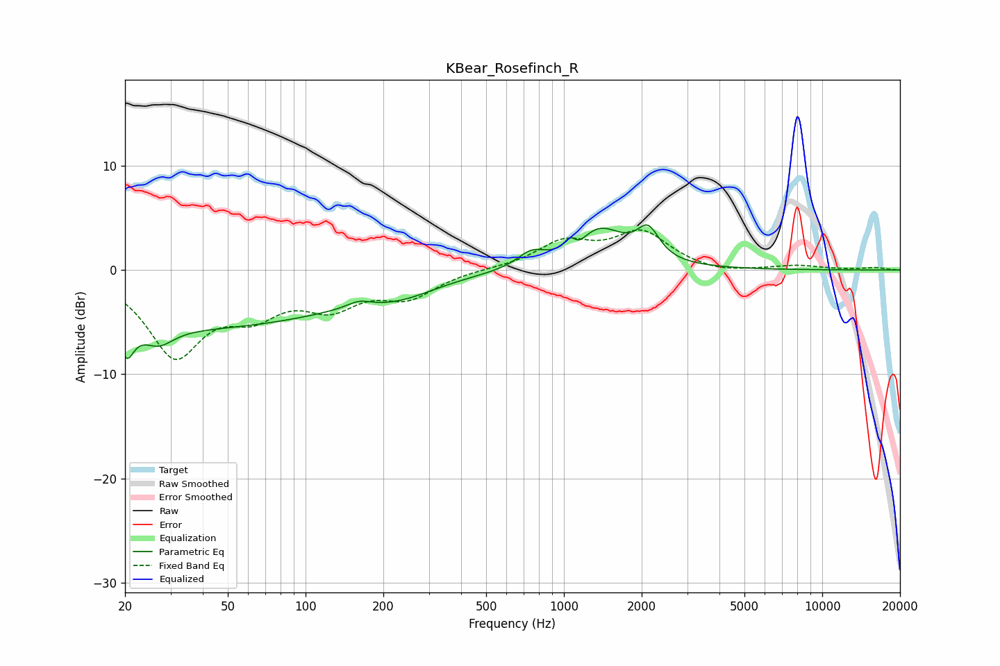

# KBear_Rosefinch_R
See [usage instructions](https://github.com/jaakkopasanen/AutoEq#usage) for more options and info.

### Parametric EQs
Apply preamp of -4.4 dB when using parametric equalizer.

|   # | Type    |   Fc (Hz) |    Q |   Gain (dB) |
|-----|---------|-----------|------|-------------|
|   1 | Peaking |        20 | 5.4  |        -2.8 |
|   2 | Peaking |        27 | 2.5  |        -1.7 |
|   3 | Peaking |        36 | 0.21 |        -5.5 |
|   4 | Peaking |       161 | 3.18 |         0.6 |
|   5 | Peaking |       235 | 1.06 |        -1.1 |
|   6 | Peaking |       747 | 2.67 |         1.3 |
|   7 | Peaking |      1062 | 5.51 |         2.2 |
|   8 | Peaking |      1089 | 3.67 |        -2.1 |
|   9 | Peaking |      1352 | 1.37 |         4   |
|  10 | Peaking |      2119 | 3.33 |         2.8 |

### Fixed Band EQs
When using fixed band (also called graphic) equalizer, apply preamp of **-3.9 dB** (if available) and set gains manually with these parameters.

|   # | Type    |   Fc (Hz) |    Q |   Gain (dB) |
|-----|---------|-----------|------|-------------|
|   1 | Peaking |        31 | 1.41 |        -7.8 |
|   2 | Peaking |        62 | 1.41 |        -3.3 |
|   3 | Peaking |       125 | 1.41 |        -3   |
|   4 | Peaking |       250 | 1.41 |        -2.4 |
|   5 | Peaking |       500 | 1.41 |         0.1 |
|   6 | Peaking |      1000 | 1.41 |         2.5 |
|   7 | Peaking |      2000 | 1.41 |         3.5 |
|   8 | Peaking |      4000 | 1.41 |        -0.4 |
|   9 | Peaking |      8000 | 1.41 |         0.4 |
|  10 | Peaking |     16000 | 1.41 |         0.2 |

### Graphs

