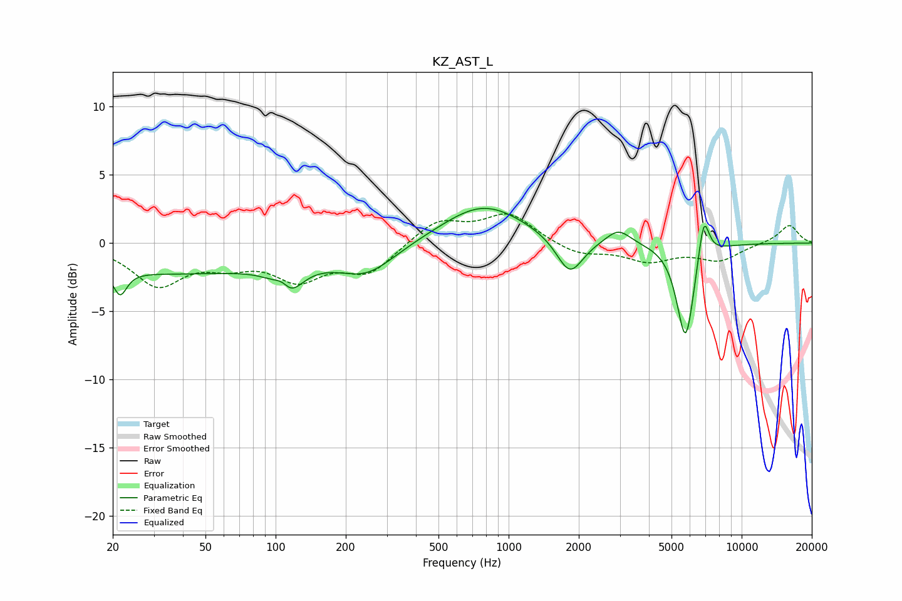

# KZ_AST_L
See [usage instructions](https://github.com/jaakkopasanen/AutoEq#usage) for more options and info.

### Parametric EQs
Apply preamp of -2.6 dB when using parametric equalizer.

|   # | Type    |   Fc (Hz) |    Q |   Gain (dB) |
|-----|---------|-----------|------|-------------|
|   1 | Peaking |        22 | 5.03 |        -1.8 |
|   2 | Peaking |        36 | 0.28 |        -2.2 |
|   3 | Peaking |       108 | 3.62 |         1.8 |
|   4 | Peaking |       111 | 2.54 |        -3.1 |
|   5 | Peaking |       246 | 1.13 |        -2   |
|   6 | Peaking |       780 | 0.8  |         2.9 |
|   7 | Peaking |      1831 | 2.47 |        -2.8 |
|   8 | Peaking |      2958 | 2.71 |         1.1 |
|   9 | Peaking |      5746 | 3.68 |        -7.2 |
|  10 | Peaking |      6875 | 5.78 |         3.3 |

### Fixed Band EQs
When using fixed band (also called graphic) equalizer, apply preamp of **-2.2 dB** (if available) and set gains manually with these parameters.

|   # | Type    |   Fc (Hz) |    Q |   Gain (dB) |
|-----|---------|-----------|------|-------------|
|   1 | Peaking |        31 | 1.41 |        -2.9 |
|   2 | Peaking |        62 | 1.41 |        -1.2 |
|   3 | Peaking |       125 | 1.41 |        -2.4 |
|   4 | Peaking |       250 | 1.41 |        -2.1 |
|   5 | Peaking |       500 | 1.41 |         1.7 |
|   6 | Peaking |      1000 | 1.41 |         2.1 |
|   7 | Peaking |      2000 | 1.41 |        -0.9 |
|   8 | Peaking |      4000 | 1.41 |        -1.2 |
|   9 | Peaking |      8000 | 1.41 |        -1.2 |
|  10 | Peaking |     16000 | 1.41 |         1.4 |

### Graphs

