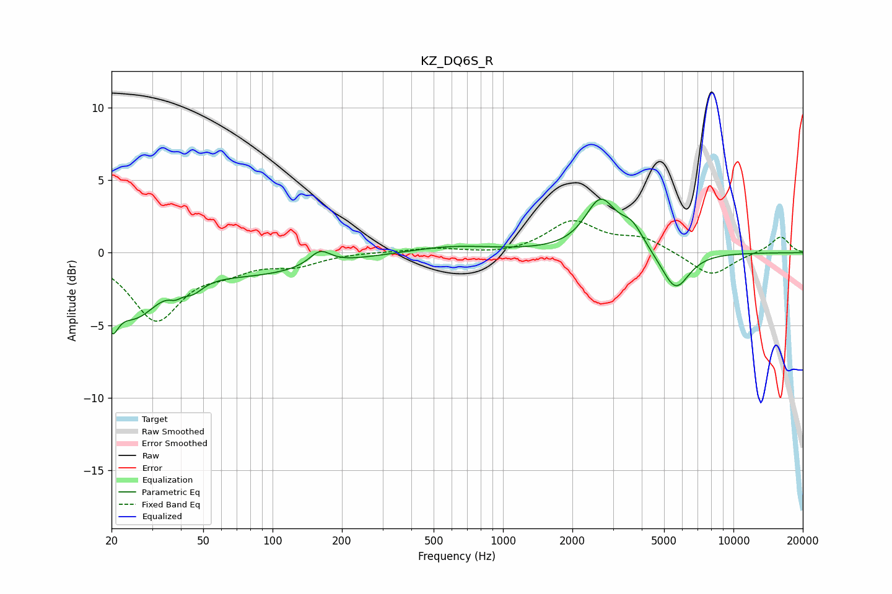

# KZ_DQ6S_R
See [usage instructions](https://github.com/jaakkopasanen/AutoEq#usage) for more options and info.

### Parametric EQs
Apply preamp of -3.8 dB when using parametric equalizer.

|   # | Type    |   Fc (Hz) |    Q |   Gain (dB) |
|-----|---------|-----------|------|-------------|
|   1 | Peaking |        20 | 4.96 |        -2.6 |
|   2 | Peaking |        25 | 1.37 |        -3.6 |
|   3 | Peaking |        38 | 5.5  |        -0.5 |
|   4 | Peaking |        45 | 3.11 |        -0.8 |
|   5 | Peaking |        84 | 0.47 |        -1.4 |
|   6 | Peaking |       161 | 3.07 |         1   |
|   7 | Peaking |       600 | 0.76 |         0.5 |
|   8 | Peaking |      2648 | 2.12 |         3.5 |
|   9 | Peaking |      3626 | 2.75 |         1.5 |
|  10 | Peaking |      5601 | 2.3  |        -2.7 |

### Fixed Band EQs
When using fixed band (also called graphic) equalizer, apply preamp of **-2.3 dB** (if available) and set gains manually with these parameters.

|   # | Type    |   Fc (Hz) |    Q |   Gain (dB) |
|-----|---------|-----------|------|-------------|
|   1 | Peaking |        31 | 1.41 |        -4.5 |
|   2 | Peaking |        62 | 1.41 |        -0.9 |
|   3 | Peaking |       125 | 1.41 |        -0.8 |
|   4 | Peaking |       250 | 1.41 |         0.1 |
|   5 | Peaking |       500 | 1.41 |         0.3 |
|   6 | Peaking |      1000 | 1.41 |        -0.2 |
|   7 | Peaking |      2000 | 1.41 |         2.1 |
|   8 | Peaking |      4000 | 1.41 |         0.9 |
|   9 | Peaking |      8000 | 1.41 |        -1.7 |
|  10 | Peaking |     16000 | 1.41 |         1.1 |

### Graphs

