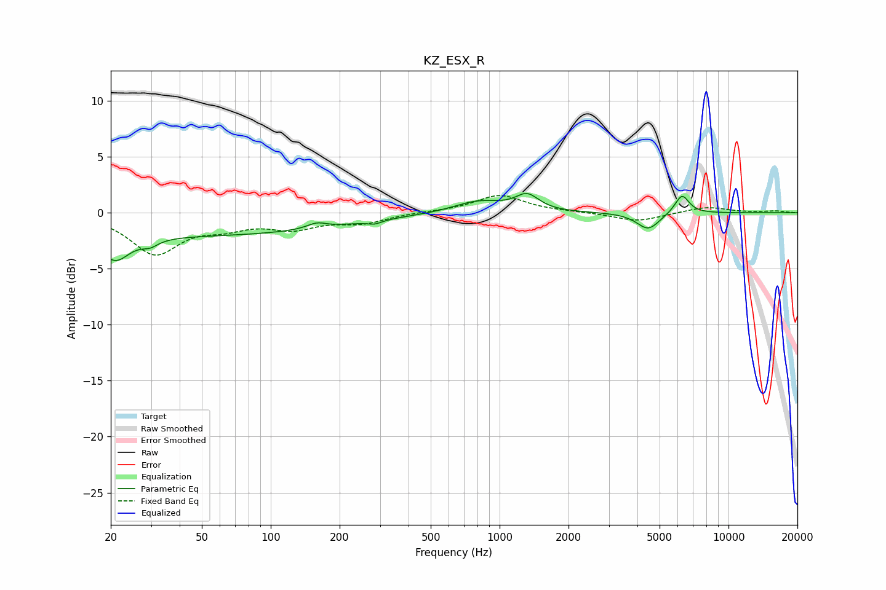

# KZ_ESX_R
See [usage instructions](https://github.com/jaakkopasanen/AutoEq#usage) for more options and info.

### Parametric EQs
Apply preamp of -1.8 dB when using parametric equalizer.

|   # | Type    |   Fc (Hz) |    Q |   Gain (dB) |
|-----|---------|-----------|------|-------------|
|   1 | Peaking |        21 | 2.28 |        -2.3 |
|   2 | Peaking |        30 | 4    |        -0.6 |
|   3 | Peaking |        42 | 0.18 |        -2   |
|   4 | Peaking |       159 | 3.33 |         0.5 |
|   5 | Peaking |       284 | 4.57 |        -0.3 |
|   6 | Peaking |       808 | 1.3  |         1.1 |
|   7 | Peaking |      1319 | 2.79 |         1.4 |
|   8 | Peaking |      4462 | 2.8  |        -1.5 |
|   9 | Peaking |      6117 | 4.61 |        -0.3 |
|  10 | Peaking |      6239 | 4.38 |         2   |

### Fixed Band EQs
When using fixed band (also called graphic) equalizer, apply preamp of **-1.6 dB** (if available) and set gains manually with these parameters.

|   # | Type    |   Fc (Hz) |    Q |   Gain (dB) |
|-----|---------|-----------|------|-------------|
|   1 | Peaking |        31 | 1.41 |        -3.5 |
|   2 | Peaking |        62 | 1.41 |        -1   |
|   3 | Peaking |       125 | 1.41 |        -1.2 |
|   4 | Peaking |       250 | 1.41 |        -0.8 |
|   5 | Peaking |       500 | 1.41 |         0.1 |
|   6 | Peaking |      1000 | 1.41 |         1.6 |
|   7 | Peaking |      2000 | 1.41 |         0   |
|   8 | Peaking |      4000 | 1.41 |        -0.8 |
|   9 | Peaking |      8000 | 1.41 |         0.5 |
|  10 | Peaking |     16000 | 1.41 |         0.2 |

### Graphs

