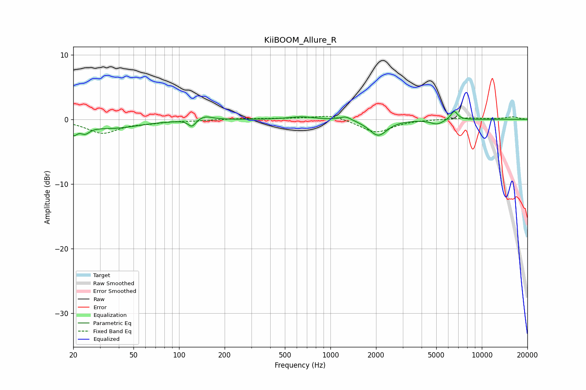

# KiiBOOM_Allure_R
See [usage instructions](https://github.com/jaakkopasanen/AutoEq#usage) for more options and info.

### Parametric EQs
Apply preamp of -1.3 dB when using parametric equalizer.

|   # | Type    |   Fc (Hz) |    Q |   Gain (dB) |
|-----|---------|-----------|------|-------------|
|   1 | Peaking |        20 | 5.66 |        -1.5 |
|   2 | Peaking |        24 | 4.63 |        -1.1 |
|   3 | Peaking |        36 | 0.75 |        -1.3 |
|   4 | Peaking |       122 | 5.9  |        -1.1 |
|   5 | Peaking |       148 | 2.92 |         0.6 |
|   6 | Peaking |       644 | 1.76 |         0.4 |
|   7 | Peaking |      1261 | 3.79 |         0.6 |
|   8 | Peaking |      2067 | 2.43 |        -2.5 |
|   9 | Peaking |      5069 | 3.28 |        -0.7 |
|  10 | Peaking |      6563 | 5.99 |         1.4 |

### Fixed Band EQs
When using fixed band (also called graphic) equalizer, apply preamp of **-0.5 dB** (if available) and set gains manually with these parameters.

|   # | Type    |   Fc (Hz) |    Q |   Gain (dB) |
|-----|---------|-----------|------|-------------|
|   1 | Peaking |        31 | 1.41 |        -2.1 |
|   2 | Peaking |        62 | 1.41 |        -0.4 |
|   3 | Peaking |       125 | 1.41 |        -0.2 |
|   4 | Peaking |       250 | 1.41 |         0.1 |
|   5 | Peaking |       500 | 1.41 |         0.1 |
|   6 | Peaking |      1000 | 1.41 |         0.8 |
|   7 | Peaking |      2000 | 1.41 |        -2.1 |
|   8 | Peaking |      4000 | 1.41 |         0   |
|   9 | Peaking |      8000 | 1.41 |         0.2 |
|  10 | Peaking |     16000 | 1.41 |         0.4 |

### Graphs

