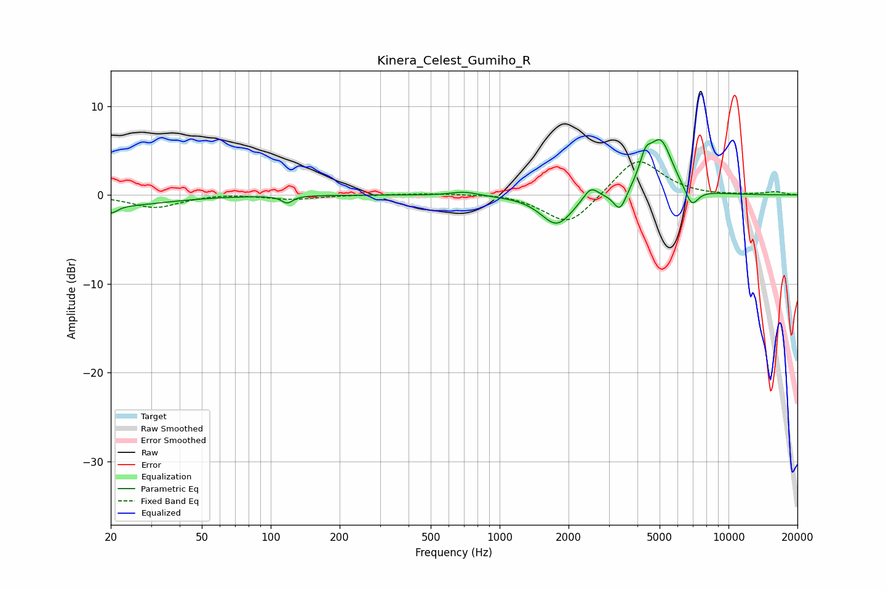

# Kinera_Celest_Gumiho_R
See [usage instructions](https://github.com/jaakkopasanen/AutoEq#usage) for more options and info.

### Parametric EQs
Apply preamp of -6.3 dB when using parametric equalizer.

|   # | Type    |   Fc (Hz) |    Q |   Gain (dB) |
|-----|---------|-----------|------|-------------|
|   1 | Peaking |        20 | 4.95 |        -1   |
|   2 | Peaking |        23 | 0.7  |        -1.1 |
|   3 | Peaking |       118 | 5.94 |        -0.8 |
|   4 | Peaking |       700 | 2.47 |         0.4 |
|   5 | Peaking |      1777 | 2.05 |        -3.4 |
|   6 | Peaking |      2499 | 4.34 |         1.5 |
|   7 | Peaking |      3357 | 5.04 |        -2.3 |
|   8 | Peaking |      4334 | 5.38 |         2.5 |
|   9 | Peaking |      5053 | 2.64 |         6   |
|  10 | Peaking |      6902 | 4.59 |        -2.2 |

### Fixed Band EQs
When using fixed band (also called graphic) equalizer, apply preamp of **-3.8 dB** (if available) and set gains manually with these parameters.

|   # | Type    |   Fc (Hz) |    Q |   Gain (dB) |
|-----|---------|-----------|------|-------------|
|   1 | Peaking |        31 | 1.41 |        -1.4 |
|   2 | Peaking |        62 | 1.41 |         0.2 |
|   3 | Peaking |       125 | 1.41 |        -0.5 |
|   4 | Peaking |       250 | 1.41 |         0   |
|   5 | Peaking |       500 | 1.41 |         0.2 |
|   6 | Peaking |      1000 | 1.41 |         0.2 |
|   7 | Peaking |      2000 | 1.41 |        -3.6 |
|   8 | Peaking |      4000 | 1.41 |         4.3 |
|   9 | Peaking |      8000 | 1.41 |        -0.1 |
|  10 | Peaking |     16000 | 1.41 |         0.3 |

### Graphs

