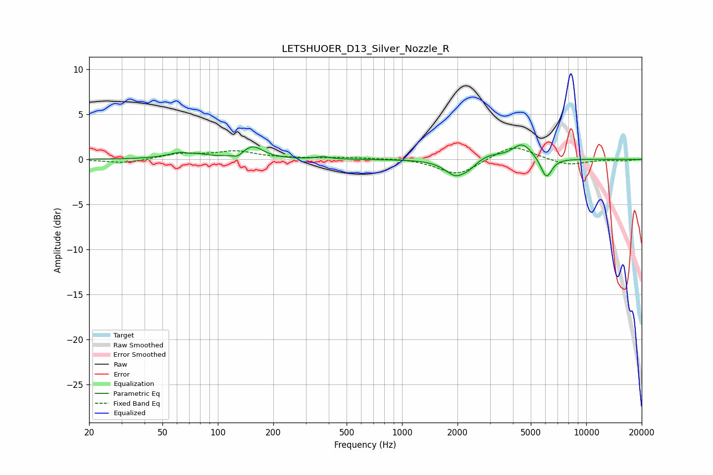

# LETSHUOER_D13_Silver_Nozzle_R
See [usage instructions](https://github.com/jaakkopasanen/AutoEq#usage) for more options and info.

### Parametric EQs
Apply preamp of -1.7 dB when using parametric equalizer.

|   # | Type    |   Fc (Hz) |    Q |   Gain (dB) |
|-----|---------|-----------|------|-------------|
|   1 | Peaking |        67 | 1.88 |         0.9 |
|   2 | Peaking |        70 | 5.24 |        -0.3 |
|   3 | Peaking |       128 | 6    |        -0.4 |
|   4 | Peaking |       155 | 2.59 |         1.4 |
|   5 | Peaking |       372 | 4.1  |         0.2 |
|   6 | Peaking |      1965 | 2.44 |        -1.8 |
|   7 | Peaking |      2323 | 4.07 |        -0.4 |
|   8 | Peaking |      2986 | 2.12 |         0.5 |
|   9 | Peaking |      4503 | 2.52 |         1.8 |
|  10 | Peaking |      6075 | 4.57 |        -2.3 |

### Fixed Band EQs
When using fixed band (also called graphic) equalizer, apply preamp of **-1.3 dB** (if available) and set gains manually with these parameters.

|   # | Type    |   Fc (Hz) |    Q |   Gain (dB) |
|-----|---------|-----------|------|-------------|
|   1 | Peaking |        31 | 1.41 |        -0.4 |
|   2 | Peaking |        62 | 1.41 |         0.6 |
|   3 | Peaking |       125 | 1.41 |         0.8 |
|   4 | Peaking |       250 | 1.41 |         0.1 |
|   5 | Peaking |       500 | 1.41 |         0.2 |
|   6 | Peaking |      1000 | 1.41 |         0.2 |
|   7 | Peaking |      2000 | 1.41 |        -1.8 |
|   8 | Peaking |      4000 | 1.41 |         1.6 |
|   9 | Peaking |      8000 | 1.41 |        -0.7 |
|  10 | Peaking |     16000 | 1.41 |        -0.2 |

### Graphs

