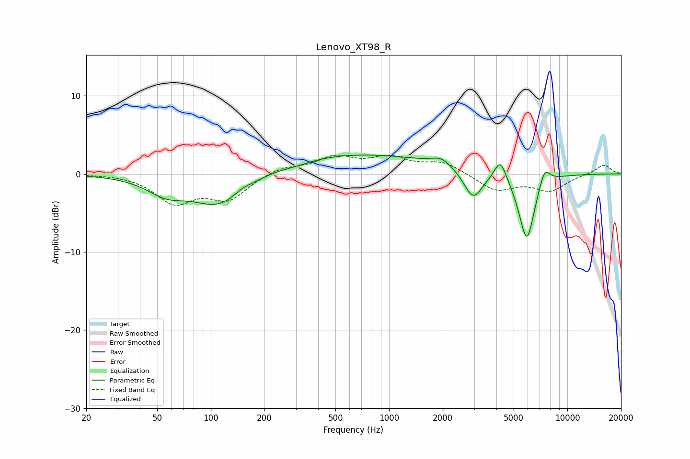

# Lenovo_XT98_R
See [usage instructions](https://github.com/jaakkopasanen/AutoEq#usage) for more options and info.

### Parametric EQs
Apply preamp of -2.5 dB when using parametric equalizer.

|   # | Type    |   Fc (Hz) |    Q |   Gain (dB) |
|-----|---------|-----------|------|-------------|
|   1 | Peaking |        56 | 1.29 |        -2   |
|   2 | Peaking |       113 | 0.92 |        -4.2 |
|   3 | Peaking |       149 | 2.89 |         0.5 |
|   4 | Peaking |       301 | 1.59 |        -0.4 |
|   5 | Peaking |       614 | 0.29 |         2.6 |
|   6 | Peaking |      1965 | 2.52 |         1   |
|   7 | Peaking |      2962 | 2.69 |        -3.7 |
|   8 | Peaking |      4212 | 4.28 |         2.7 |
|   9 | Peaking |      5920 | 3.08 |        -8.7 |
|  10 | Peaking |      7451 | 4.44 |         2.3 |

### Fixed Band EQs
When using fixed band (also called graphic) equalizer, apply preamp of **-2.5 dB** (if available) and set gains manually with these parameters.

|   # | Type    |   Fc (Hz) |    Q |   Gain (dB) |
|-----|---------|-----------|------|-------------|
|   1 | Peaking |        31 | 1.41 |         0.1 |
|   2 | Peaking |        62 | 1.41 |        -3.5 |
|   3 | Peaking |       125 | 1.41 |        -3.1 |
|   4 | Peaking |       250 | 1.41 |         0.9 |
|   5 | Peaking |       500 | 1.41 |         2   |
|   6 | Peaking |      1000 | 1.41 |         1.8 |
|   7 | Peaking |      2000 | 1.41 |         1.5 |
|   8 | Peaking |      4000 | 1.41 |        -2.1 |
|   9 | Peaking |      8000 | 1.41 |        -2   |
|  10 | Peaking |     16000 | 1.41 |         1.2 |

### Graphs

