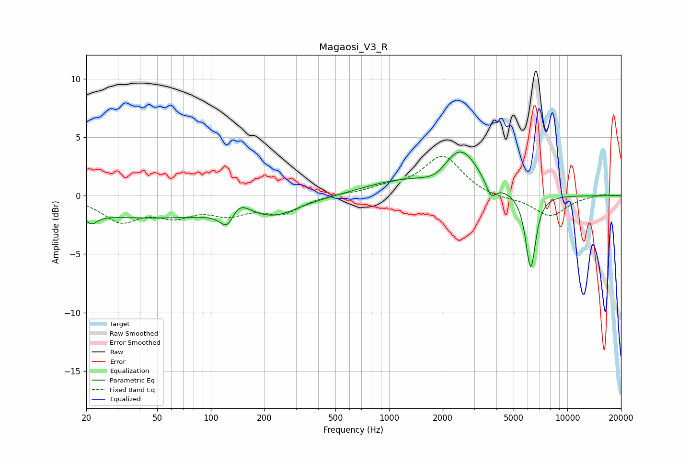

# Magaosi_V3_R
See [usage instructions](https://github.com/jaakkopasanen/AutoEq#usage) for more options and info.

### Parametric EQs
Apply preamp of -3.8 dB when using parametric equalizer.

|   # | Type    |   Fc (Hz) |    Q |   Gain (dB) |
|-----|---------|-----------|------|-------------|
|   1 | Peaking |        21 | 4.4  |        -0.8 |
|   2 | Peaking |        47 | 0.23 |        -1.9 |
|   3 | Peaking |       125 | 3.26 |        -1.9 |
|   4 | Peaking |       140 | 2.34 |         1.7 |
|   5 | Peaking |       230 | 1.11 |        -1.1 |
|   6 | Peaking |      1085 | 0.71 |         1.1 |
|   7 | Peaking |      1828 | 2.34 |        -0.5 |
|   8 | Peaking |      2529 | 1.45 |         3.7 |
|   9 | Peaking |      3732 | 4.95 |        -1.4 |
|  10 | Peaking |      6228 | 4.83 |        -6.4 |

### Fixed Band EQs
When using fixed band (also called graphic) equalizer, apply preamp of **-3.5 dB** (if available) and set gains manually with these parameters.

|   # | Type    |   Fc (Hz) |    Q |   Gain (dB) |
|-----|---------|-----------|------|-------------|
|   1 | Peaking |        31 | 1.41 |        -2   |
|   2 | Peaking |        62 | 1.41 |        -1.4 |
|   3 | Peaking |       125 | 1.41 |        -1.3 |
|   4 | Peaking |       250 | 1.41 |        -1.4 |
|   5 | Peaking |       500 | 1.41 |         0.1 |
|   6 | Peaking |      1000 | 1.41 |         0.6 |
|   7 | Peaking |      2000 | 1.41 |         3.4 |
|   8 | Peaking |      4000 | 1.41 |        -0.3 |
|   9 | Peaking |      8000 | 1.41 |        -1.8 |
|  10 | Peaking |     16000 | 1.41 |         0.2 |

### Graphs

