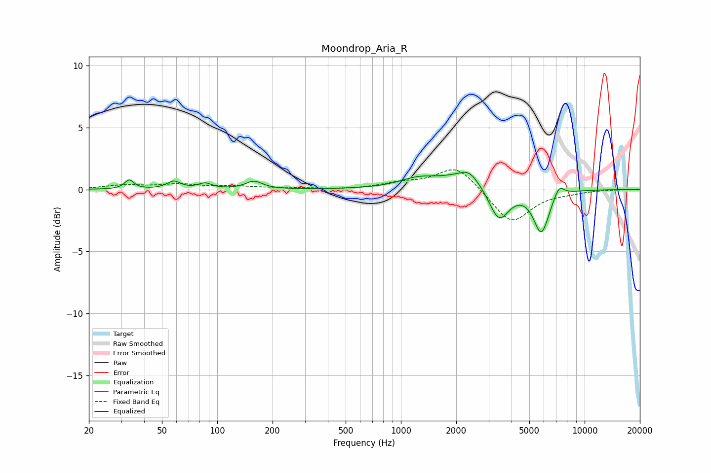

# Moondrop_Aria_R
See [usage instructions](https://github.com/jaakkopasanen/AutoEq#usage) for more options and info.

### Parametric EQs
Apply preamp of -1.5 dB when using parametric equalizer.

|   # | Type    |   Fc (Hz) |    Q |   Gain (dB) |
|-----|---------|-----------|------|-------------|
|   1 | Peaking |        33 | 5.95 |         0.7 |
|   2 | Peaking |        58 | 3.93 |         0.6 |
|   3 | Peaking |        86 | 4.01 |         0.4 |
|   4 | Peaking |       159 | 3.13 |         0.6 |
|   5 | Peaking |      1237 | 1.4  |         0.7 |
|   6 | Peaking |      2308 | 1.13 |         1.3 |
|   7 | Peaking |      2347 | 3.49 |         0.5 |
|   8 | Peaking |      3410 | 2.49 |        -2.9 |
|   9 | Peaking |      5811 | 3.23 |        -3.5 |
|  10 | Peaking |      7259 | 4.79 |         0.9 |

### Fixed Band EQs
When using fixed band (also called graphic) equalizer, apply preamp of **-1.7 dB** (if available) and set gains manually with these parameters.

|   # | Type    |   Fc (Hz) |    Q |   Gain (dB) |
|-----|---------|-----------|------|-------------|
|   1 | Peaking |        31 | 1.41 |         0.3 |
|   2 | Peaking |        62 | 1.41 |         0.4 |
|   3 | Peaking |       125 | 1.41 |         0.2 |
|   4 | Peaking |       250 | 1.41 |         0.1 |
|   5 | Peaking |       500 | 1.41 |        -0   |
|   6 | Peaking |      1000 | 1.41 |         0.4 |
|   7 | Peaking |      2000 | 1.41 |         2   |
|   8 | Peaking |      4000 | 1.41 |        -2.8 |
|   9 | Peaking |      8000 | 1.41 |        -0.2 |
|  10 | Peaking |     16000 | 1.41 |         0   |

### Graphs

