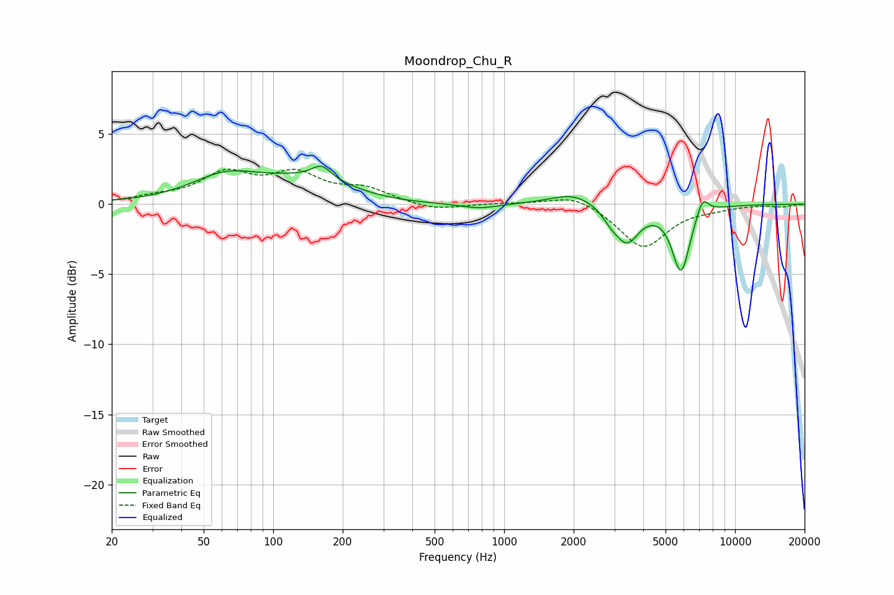

# Moondrop_Chu_R
See [usage instructions](https://github.com/jaakkopasanen/AutoEq#usage) for more options and info.

### Parametric EQs
Apply preamp of -2.8 dB when using parametric equalizer.

|   # | Type    |   Fc (Hz) |    Q |   Gain (dB) |
|-----|---------|-----------|------|-------------|
|   1 | Peaking |        61 | 0.99 |         1.5 |
|   2 | Peaking |       162 | 3.39 |         1   |
|   3 | Peaking |       163 | 0.55 |         2.6 |
|   4 | Peaking |       233 | 0.57 |        -1.3 |
|   5 | Peaking |       782 | 1.76 |        -0.4 |
|   6 | Peaking |      2008 | 1.44 |         0.9 |
|   7 | Peaking |      2904 | 3.63 |        -0.6 |
|   8 | Peaking |      3407 | 2.65 |        -2.5 |
|   9 | Peaking |      5834 | 3.55 |        -4.7 |
|  10 | Peaking |      7231 | 5.1  |         1.3 |

### Fixed Band EQs
When using fixed band (also called graphic) equalizer, apply preamp of **-2.6 dB** (if available) and set gains manually with these parameters.

|   # | Type    |   Fc (Hz) |    Q |   Gain (dB) |
|-----|---------|-----------|------|-------------|
|   1 | Peaking |        31 | 1.41 |         0.4 |
|   2 | Peaking |        62 | 1.41 |         2   |
|   3 | Peaking |       125 | 1.41 |         1.9 |
|   4 | Peaking |       250 | 1.41 |         1   |
|   5 | Peaking |       500 | 1.41 |        -0.5 |
|   6 | Peaking |      1000 | 1.41 |         0.1 |
|   7 | Peaking |      2000 | 1.41 |         0.8 |
|   8 | Peaking |      4000 | 1.41 |        -3.1 |
|   9 | Peaking |      8000 | 1.41 |        -0.2 |
|  10 | Peaking |     16000 | 1.41 |        -0.2 |

### Graphs

