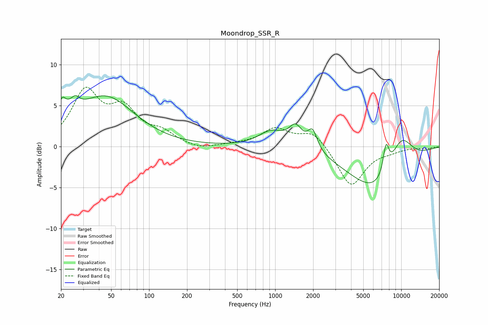

# Moondrop_SSR_R
See [usage instructions](https://github.com/jaakkopasanen/AutoEq#usage) for more options and info.

### Parametric EQs
Apply preamp of -6.3 dB when using parametric equalizer.

|   # | Type    |   Fc (Hz) |    Q |   Gain (dB) |
|-----|---------|-----------|------|-------------|
|   1 | Peaking |        20 | 5.88 |         1.6 |
|   2 | Peaking |        22 | 1.63 |         1.8 |
|   3 | Peaking |        26 | 4.8  |         0.9 |
|   4 | Peaking |        45 | 0.63 |         5.9 |
|   5 | Peaking |       931 | 1.41 |         1.9 |
|   6 | Peaking |      1451 | 2.69 |         2.4 |
|   7 | Peaking |      1979 | 3.8  |         2.4 |
|   8 | Peaking |      6810 | 0.58 |        -6.4 |
|   9 | Peaking |      7575 | 5.56 |         3.4 |
|  10 | Peaking |      9845 | 1.18 |         5.1 |

### Fixed Band EQs
When using fixed band (also called graphic) equalizer, apply preamp of **-7.4 dB** (if available) and set gains manually with these parameters.

|   # | Type    |   Fc (Hz) |    Q |   Gain (dB) |
|-----|---------|-----------|------|-------------|
|   1 | Peaking |        31 | 1.41 |         6.4 |
|   2 | Peaking |        62 | 1.41 |         4   |
|   3 | Peaking |       125 | 1.41 |         1.4 |
|   4 | Peaking |       250 | 1.41 |        -0.5 |
|   5 | Peaking |       500 | 1.41 |         0.2 |
|   6 | Peaking |      1000 | 1.41 |         2.1 |
|   7 | Peaking |      2000 | 1.41 |         1.9 |
|   8 | Peaking |      4000 | 1.41 |        -4.9 |
|   9 | Peaking |      8000 | 1.41 |        -0.4 |
|  10 | Peaking |     16000 | 1.41 |        -0.2 |

### Graphs

