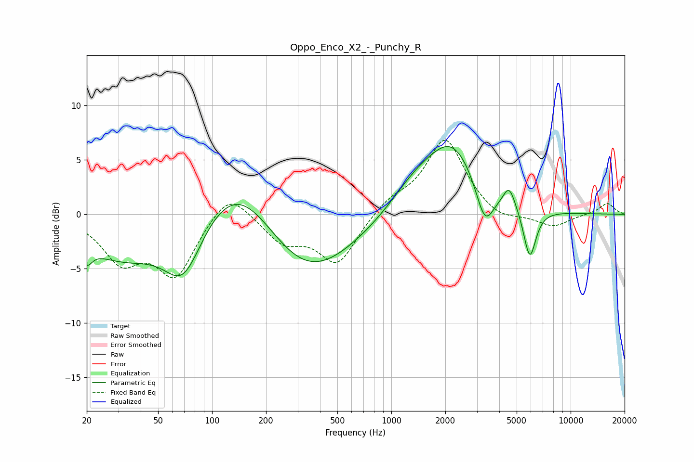

# Oppo_Enco_X2_-_Punchy_R
See [usage instructions](https://github.com/jaakkopasanen/AutoEq#usage) for more options and info.

### Parametric EQs
Apply preamp of -6.3 dB when using parametric equalizer.

|   # | Type    |   Fc (Hz) |    Q |   Gain (dB) |
|-----|---------|-----------|------|-------------|
|   1 | Peaking |        20 | 4.85 |        -1.6 |
|   2 | Peaking |        31 | 0.61 |        -3.9 |
|   3 | Peaking |        69 | 1.31 |        -5.5 |
|   4 | Peaking |       141 | 0.64 |         5.9 |
|   5 | Peaking |       325 | 0.52 |        -6.6 |
|   6 | Peaking |      1353 | 0.96 |         2.3 |
|   7 | Peaking |      2200 | 0.98 |         6   |
|   8 | Peaking |      3323 | 2.77 |        -3.8 |
|   9 | Peaking |      4546 | 4.15 |         2   |
|  10 | Peaking |      5918 | 3.95 |        -4.7 |

### Fixed Band EQs
When using fixed band (also called graphic) equalizer, apply preamp of **-6.9 dB** (if available) and set gains manually with these parameters.

|   # | Type    |   Fc (Hz) |    Q |   Gain (dB) |
|-----|---------|-----------|------|-------------|
|   1 | Peaking |        31 | 1.41 |        -3.9 |
|   2 | Peaking |        62 | 1.41 |        -5.4 |
|   3 | Peaking |       125 | 1.41 |         2.6 |
|   4 | Peaking |       250 | 1.41 |        -2.4 |
|   5 | Peaking |       500 | 1.41 |        -4.5 |
|   6 | Peaking |      1000 | 1.41 |         1.2 |
|   7 | Peaking |      2000 | 1.41 |         6.9 |
|   8 | Peaking |      4000 | 1.41 |        -0.9 |
|   9 | Peaking |      8000 | 1.41 |        -1.2 |
|  10 | Peaking |     16000 | 1.41 |         1   |

### Graphs

