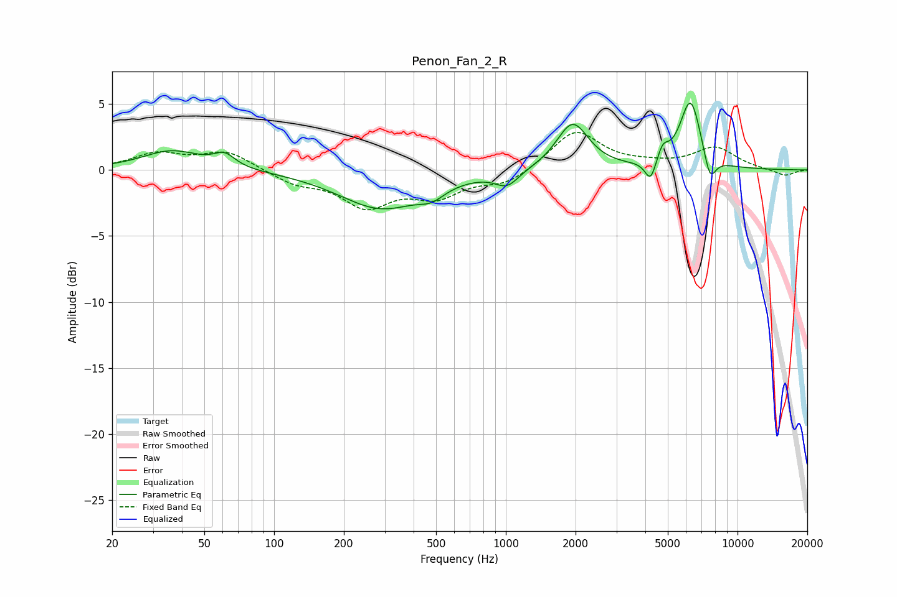

# Penon_Fan_2_R
See [usage instructions](https://github.com/jaakkopasanen/AutoEq#usage) for more options and info.

### Parametric EQs
Apply preamp of -5.2 dB when using parametric equalizer.

|   # | Type    |   Fc (Hz) |    Q |   Gain (dB) |
|-----|---------|-----------|------|-------------|
|   1 | Peaking |        36 | 1.12 |         1.5 |
|   2 | Peaking |        61 | 3.15 |         0.9 |
|   3 | Peaking |       290 | 0.78 |        -2.9 |
|   4 | Peaking |       479 | 2.56 |        -0.8 |
|   5 | Peaking |      1013 | 2.81 |        -1.1 |
|   6 | Peaking |      1942 | 2.06 |         3.6 |
|   7 | Peaking |      4213 | 5.95 |        -1.6 |
|   8 | Peaking |      4757 | 5.95 |         1.1 |
|   9 | Peaking |      6270 | 2.98 |         5.3 |
|  10 | Peaking |      7599 | 5.14 |        -2.1 |

### Fixed Band EQs
When using fixed band (also called graphic) equalizer, apply preamp of **-2.9 dB** (if available) and set gains manually with these parameters.

|   # | Type    |   Fc (Hz) |    Q |   Gain (dB) |
|-----|---------|-----------|------|-------------|
|   1 | Peaking |        31 | 1.41 |         1.2 |
|   2 | Peaking |        62 | 1.41 |         1.4 |
|   3 | Peaking |       125 | 1.41 |        -0.9 |
|   4 | Peaking |       250 | 1.41 |        -2.6 |
|   5 | Peaking |       500 | 1.41 |        -1.8 |
|   6 | Peaking |      1000 | 1.41 |        -1   |
|   7 | Peaking |      2000 | 1.41 |         3   |
|   8 | Peaking |      4000 | 1.41 |         0.3 |
|   9 | Peaking |      8000 | 1.41 |         1.6 |
|  10 | Peaking |     16000 | 1.41 |        -0.5 |

### Graphs

