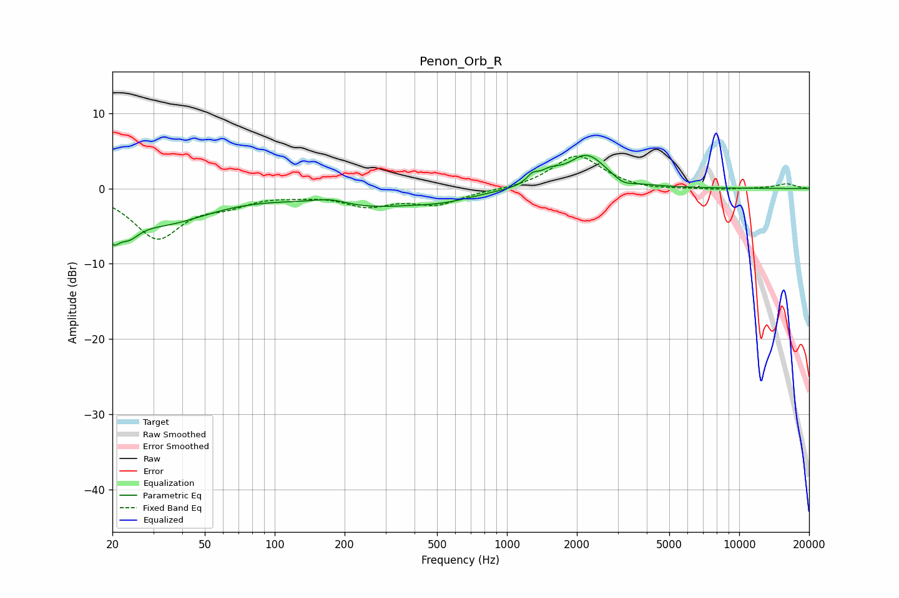

# Penon_Orb_R
See [usage instructions](https://github.com/jaakkopasanen/AutoEq#usage) for more options and info.

### Parametric EQs
Apply preamp of -4.5 dB when using parametric equalizer.

|   # | Type    |   Fc (Hz) |    Q |   Gain (dB) |
|-----|---------|-----------|------|-------------|
|   1 | Peaking |        20 | 5.22 |        -3.1 |
|   2 | Peaking |        23 | 2.97 |        -2.5 |
|   3 | Peaking |        33 | 0.67 |        -4.3 |
|   4 | Peaking |       173 | 1.83 |         0.9 |
|   5 | Peaking |       242 | 0.57 |        -2.2 |
|   6 | Peaking |       537 | 1.05 |        -0.9 |
|   7 | Peaking |      1288 | 5.83 |         1   |
|   8 | Peaking |      1529 | 3.08 |         1.3 |
|   9 | Peaking |      2211 | 1.71 |         4.4 |
|  10 | Peaking |      3167 | 3.45 |        -0.8 |

### Fixed Band EQs
When using fixed band (also called graphic) equalizer, apply preamp of **-4.4 dB** (if available) and set gains manually with these parameters.

|   # | Type    |   Fc (Hz) |    Q |   Gain (dB) |
|-----|---------|-----------|------|-------------|
|   1 | Peaking |        31 | 1.41 |        -6.4 |
|   2 | Peaking |        62 | 1.41 |        -1.6 |
|   3 | Peaking |       125 | 1.41 |        -0.5 |
|   4 | Peaking |       250 | 1.41 |        -2   |
|   5 | Peaking |       500 | 1.41 |        -1.9 |
|   6 | Peaking |      1000 | 1.41 |        -0.2 |
|   7 | Peaking |      2000 | 1.41 |         4.5 |
|   8 | Peaking |      4000 | 1.41 |        -0.3 |
|   9 | Peaking |      8000 | 1.41 |        -0.2 |
|  10 | Peaking |     16000 | 1.41 |         0.6 |

### Graphs

