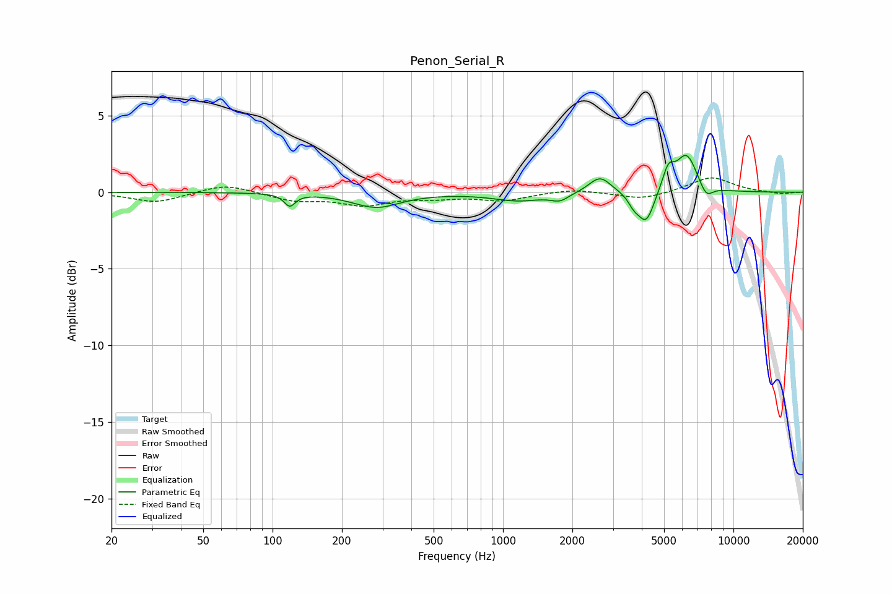

# Penon_Serial_R
See [usage instructions](https://github.com/jaakkopasanen/AutoEq#usage) for more options and info.

### Parametric EQs
Apply preamp of -2.5 dB when using parametric equalizer.

|   # | Type    |   Fc (Hz) |    Q |   Gain (dB) |
|-----|---------|-----------|------|-------------|
|   1 | Peaking |       119 | 6    |        -0.8 |
|   2 | Peaking |       282 | 1.37 |        -1   |
|   3 | Peaking |      1170 | 1.28 |        -0.5 |
|   4 | Peaking |      1766 | 3.7  |        -0.4 |
|   5 | Peaking |      2637 | 2.94 |         1.1 |
|   6 | Peaking |      3693 | 5.77 |        -0.6 |
|   7 | Peaking |      4179 | 3.9  |        -2.1 |
|   8 | Peaking |      5219 | 5.29 |         1.4 |
|   9 | Peaking |      6264 | 2.99 |         2.4 |
|  10 | Peaking |      7613 | 4.7  |        -0.8 |

### Fixed Band EQs
When using fixed band (also called graphic) equalizer, apply preamp of **-1.0 dB** (if available) and set gains manually with these parameters.

|   # | Type    |   Fc (Hz) |    Q |   Gain (dB) |
|-----|---------|-----------|------|-------------|
|   1 | Peaking |        31 | 1.41 |        -0.7 |
|   2 | Peaking |        62 | 1.41 |         0.6 |
|   3 | Peaking |       125 | 1.41 |        -0.5 |
|   4 | Peaking |       250 | 1.41 |        -0.8 |
|   5 | Peaking |       500 | 1.41 |        -0.3 |
|   6 | Peaking |      1000 | 1.41 |        -0.5 |
|   7 | Peaking |      2000 | 1.41 |         0.2 |
|   8 | Peaking |      4000 | 1.41 |        -0.5 |
|   9 | Peaking |      8000 | 1.41 |         1   |
|  10 | Peaking |     16000 | 1.41 |        -0.1 |

### Graphs

