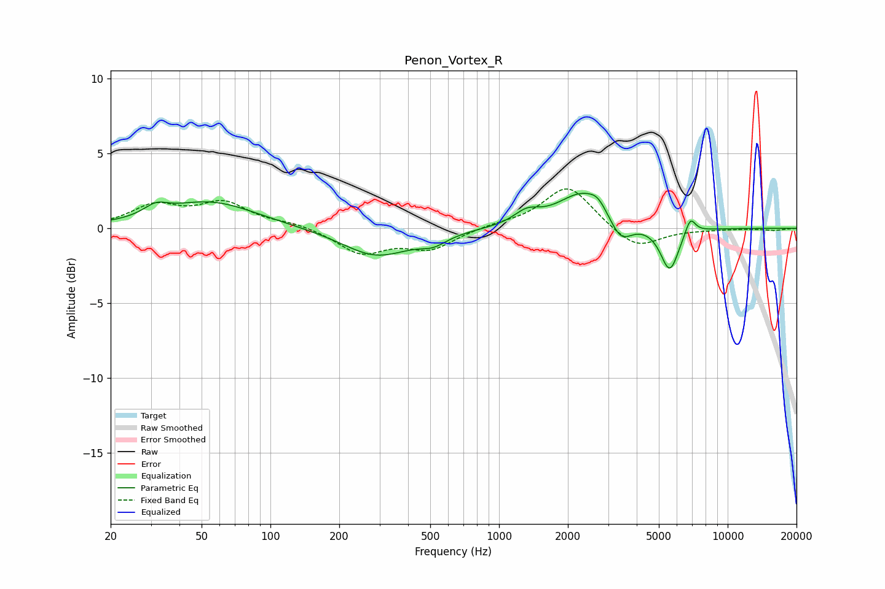

# Penon_Vortex_R
See [usage instructions](https://github.com/jaakkopasanen/AutoEq#usage) for more options and info.

### Parametric EQs
Apply preamp of -2.4 dB when using parametric equalizer.

|   # | Type    |   Fc (Hz) |    Q |   Gain (dB) |
|-----|---------|-----------|------|-------------|
|   1 | Peaking |        32 | 2.79 |         0.7 |
|   2 | Peaking |        54 | 0.7  |         1.8 |
|   3 | Peaking |       291 | 0.94 |        -1.9 |
|   4 | Peaking |       516 | 2.41 |        -0.6 |
|   5 | Peaking |      1322 | 2.56 |         0.8 |
|   6 | Peaking |      2340 | 1.26 |         2.4 |
|   7 | Peaking |      2705 | 4.1  |         0.5 |
|   8 | Peaking |      3404 | 2.85 |        -1.6 |
|   9 | Peaking |      5578 | 3.45 |        -2.9 |
|  10 | Peaking |      6863 | 6    |         1.1 |

### Fixed Band EQs
When using fixed band (also called graphic) equalizer, apply preamp of **-2.7 dB** (if available) and set gains manually with these parameters.

|   # | Type    |   Fc (Hz) |    Q |   Gain (dB) |
|-----|---------|-----------|------|-------------|
|   1 | Peaking |        31 | 1.41 |         1.4 |
|   2 | Peaking |        62 | 1.41 |         1.6 |
|   3 | Peaking |       125 | 1.41 |         0.3 |
|   4 | Peaking |       250 | 1.41 |        -1.6 |
|   5 | Peaking |       500 | 1.41 |        -1.3 |
|   6 | Peaking |      1000 | 1.41 |         0.2 |
|   7 | Peaking |      2000 | 1.41 |         2.9 |
|   8 | Peaking |      4000 | 1.41 |        -1.5 |
|   9 | Peaking |      8000 | 1.41 |        -0.1 |
|  10 | Peaking |     16000 | 1.41 |        -0.1 |

### Graphs

