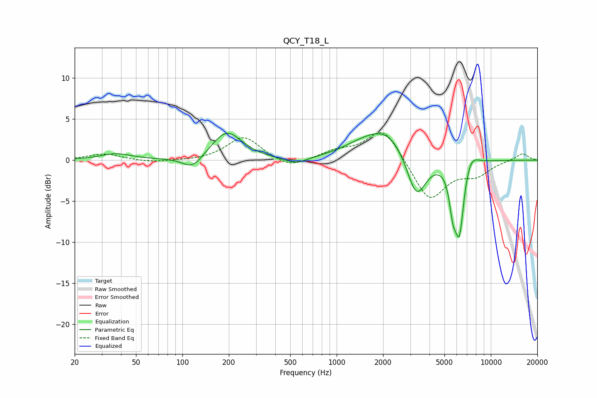

# QCY_T18_L
See [usage instructions](https://github.com/jaakkopasanen/AutoEq#usage) for more options and info.

### Parametric EQs
Apply preamp of -3.4 dB when using parametric equalizer.

|   # | Type    |   Fc (Hz) |    Q |   Gain (dB) |
|-----|---------|-----------|------|-------------|
|   1 | Peaking |        37 | 1.41 |         0.8 |
|   2 | Peaking |       116 | 2.17 |        -1.6 |
|   3 | Peaking |       194 | 1.45 |         3.5 |
|   4 | Peaking |       545 | 1.81 |        -0.8 |
|   5 | Peaking |      1454 | 1.02 |         1   |
|   6 | Peaking |      2153 | 0.98 |         3.5 |
|   7 | Peaking |      3285 | 2.18 |        -5.7 |
|   8 | Peaking |      5671 | 6    |        -4   |
|   9 | Peaking |      6254 | 4.65 |        -8.4 |
|  10 | Peaking |      7386 | 3    |         1.7 |

### Fixed Band EQs
When using fixed band (also called graphic) equalizer, apply preamp of **-3.4 dB** (if available) and set gains manually with these parameters.

|   # | Type    |   Fc (Hz) |    Q |   Gain (dB) |
|-----|---------|-----------|------|-------------|
|   1 | Peaking |        31 | 1.41 |         0.8 |
|   2 | Peaking |        62 | 1.41 |        -0.3 |
|   3 | Peaking |       125 | 1.41 |        -0.1 |
|   4 | Peaking |       250 | 1.41 |         2.9 |
|   5 | Peaking |       500 | 1.41 |        -1.1 |
|   6 | Peaking |      1000 | 1.41 |         1   |
|   7 | Peaking |      2000 | 1.41 |         4.1 |
|   8 | Peaking |      4000 | 1.41 |        -5   |
|   9 | Peaking |      8000 | 1.41 |        -1.6 |
|  10 | Peaking |     16000 | 1.41 |         0.9 |

### Graphs

