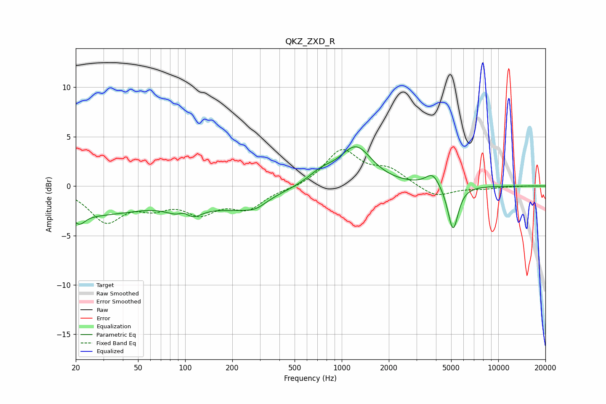

# QKZ_ZXD_R
See [usage instructions](https://github.com/jaakkopasanen/AutoEq#usage) for more options and info.

### Parametric EQs
Apply preamp of -4.1 dB when using parametric equalizer.

|   # | Type    |   Fc (Hz) |    Q |   Gain (dB) |
|-----|---------|-----------|------|-------------|
|   1 | Peaking |        21 | 4    |        -1   |
|   2 | Peaking |        24 | 0.36 |        -2.8 |
|   3 | Peaking |        99 | 3.13 |         1.9 |
|   4 | Peaking |       101 | 1.92 |        -3   |
|   5 | Peaking |       219 | 0.76 |        -1.9 |
|   6 | Peaking |       283 | 2.18 |        -0.6 |
|   7 | Peaking |       740 | 1.65 |         1.1 |
|   8 | Peaking |      1234 | 1.38 |         3.8 |
|   9 | Peaking |      3807 | 3.2  |         1.3 |
|  10 | Peaking |      5142 | 4.22 |        -4.6 |

### Fixed Band EQs
When using fixed band (also called graphic) equalizer, apply preamp of **-3.8 dB** (if available) and set gains manually with these parameters.

|   # | Type    |   Fc (Hz) |    Q |   Gain (dB) |
|-----|---------|-----------|------|-------------|
|   1 | Peaking |        31 | 1.41 |        -3.4 |
|   2 | Peaking |        62 | 1.41 |        -1.6 |
|   3 | Peaking |       125 | 1.41 |        -2.3 |
|   4 | Peaking |       250 | 1.41 |        -2.1 |
|   5 | Peaking |       500 | 1.41 |        -0.2 |
|   6 | Peaking |      1000 | 1.41 |         3.6 |
|   7 | Peaking |      2000 | 1.41 |         1.5 |
|   8 | Peaking |      4000 | 1.41 |        -1.2 |
|   9 | Peaking |      8000 | 1.41 |        -0.2 |
|  10 | Peaking |     16000 | 1.41 |         0   |

### Graphs

