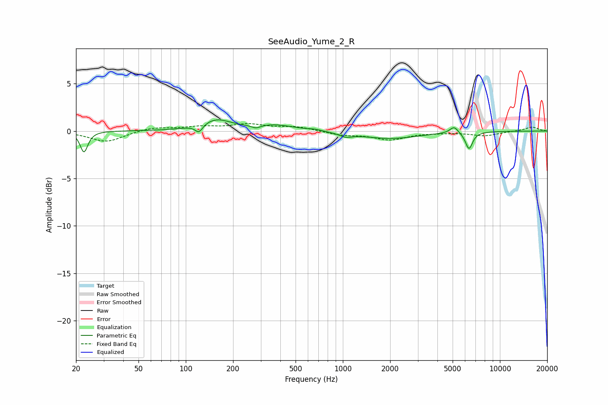

# SeeAudio_Yume_2_R
See [usage instructions](https://github.com/jaakkopasanen/AutoEq#usage) for more options and info.

### Parametric EQs
Apply preamp of -1.3 dB when using parametric equalizer.

|   # | Type    |   Fc (Hz) |    Q |   Gain (dB) |
|-----|---------|-----------|------|-------------|
|   1 | Peaking |        22 | 5.92 |        -2.2 |
|   2 | Peaking |       121 | 6    |        -0.8 |
|   3 | Peaking |       156 | 1.49 |         1.2 |
|   4 | Peaking |       280 | 5.04 |        -0.3 |
|   5 | Peaking |       369 | 1.15 |         0.6 |
|   6 | Peaking |       659 | 3.25 |         0.2 |
|   7 | Peaking |      1044 | 3.64 |        -0.4 |
|   8 | Peaking |      1993 | 0.76 |        -0.8 |
|   9 | Peaking |      5107 | 5.3  |         0.7 |
|  10 | Peaking |      6357 | 6    |        -1.8 |

### Fixed Band EQs
When using fixed band (also called graphic) equalizer, apply preamp of **-0.9 dB** (if available) and set gains manually with these parameters.

|   # | Type    |   Fc (Hz) |    Q |   Gain (dB) |
|-----|---------|-----------|------|-------------|
|   1 | Peaking |        31 | 1.41 |        -1.1 |
|   2 | Peaking |        62 | 1.41 |         0.4 |
|   3 | Peaking |       125 | 1.41 |         0.4 |
|   4 | Peaking |       250 | 1.41 |         0.6 |
|   5 | Peaking |       500 | 1.41 |         0.4 |
|   6 | Peaking |      1000 | 1.41 |        -0.4 |
|   7 | Peaking |      2000 | 1.41 |        -0.9 |
|   8 | Peaking |      4000 | 1.41 |        -0.1 |
|   9 | Peaking |      8000 | 1.41 |        -0.5 |
|  10 | Peaking |     16000 | 1.41 |         0.4 |

### Graphs

