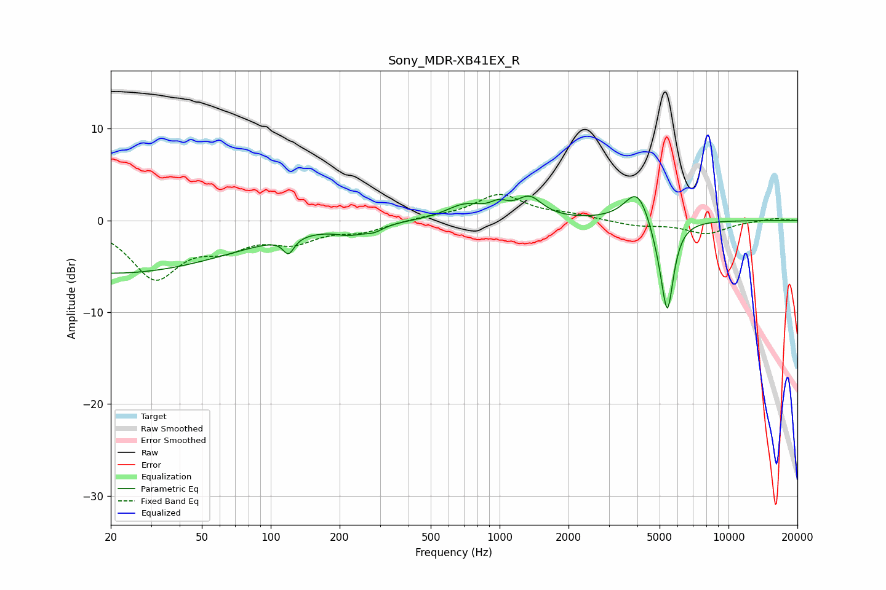

# Sony_MDR-XB41EX_R
See [usage instructions](https://github.com/jaakkopasanen/AutoEq#usage) for more options and info.

### Parametric EQs
Apply preamp of -2.8 dB when using parametric equalizer.

|   # | Type    |   Fc (Hz) |    Q |   Gain (dB) |
|-----|---------|-----------|------|-------------|
|   1 | Peaking |        20 | 0.26 |        -5.7 |
|   2 | Peaking |       120 | 5.9  |        -1.7 |
|   3 | Peaking |       221 | 2.34 |        -0.8 |
|   4 | Peaking |       282 | 3.4  |        -0.7 |
|   5 | Peaking |       705 | 1.72 |         1.6 |
|   6 | Peaking |       994 | 3.61 |         1   |
|   7 | Peaking |      1349 | 2.54 |         2.2 |
|   8 | Peaking |      3999 | 2.56 |         3.7 |
|   9 | Peaking |      5019 | 3.52 |        -1.8 |
|  10 | Peaking |      5411 | 5.2  |        -9.2 |

### Fixed Band EQs
When using fixed band (also called graphic) equalizer, apply preamp of **-2.9 dB** (if available) and set gains manually with these parameters.

|   # | Type    |   Fc (Hz) |    Q |   Gain (dB) |
|-----|---------|-----------|------|-------------|
|   1 | Peaking |        31 | 1.41 |        -6   |
|   2 | Peaking |        62 | 1.41 |        -2.3 |
|   3 | Peaking |       125 | 1.41 |        -2   |
|   4 | Peaking |       250 | 1.41 |        -1.1 |
|   5 | Peaking |       500 | 1.41 |         0.3 |
|   6 | Peaking |      1000 | 1.41 |         2.8 |
|   7 | Peaking |      2000 | 1.41 |         0.5 |
|   8 | Peaking |      4000 | 1.41 |        -0.6 |
|   9 | Peaking |      8000 | 1.41 |        -1.4 |
|  10 | Peaking |     16000 | 1.41 |         0.3 |

### Graphs

