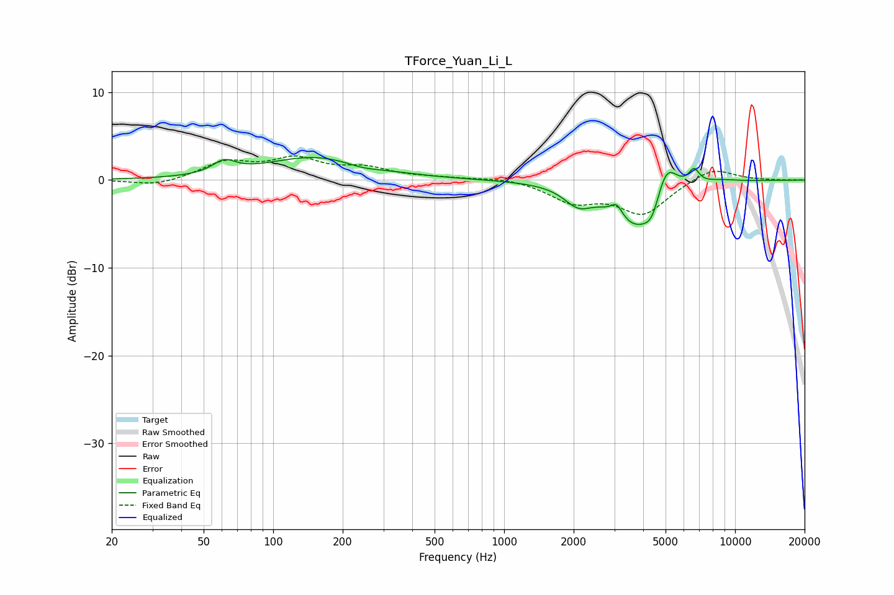

# TForce_Yuan_Li_L
See [usage instructions](https://github.com/jaakkopasanen/AutoEq#usage) for more options and info.

### Parametric EQs
Apply preamp of -2.7 dB when using parametric equalizer.

|   # | Type    |   Fc (Hz) |    Q |   Gain (dB) |
|-----|---------|-----------|------|-------------|
|   1 | Peaking |        61 | 2.9  |         1.4 |
|   2 | Peaking |       154 | 0.64 |         2.6 |
|   3 | Peaking |       243 | 1.87 |        -0.5 |
|   4 | Peaking |      2090 | 2.35 |        -2   |
|   5 | Peaking |      3075 | 5.77 |         1.4 |
|   6 | Peaking |      3743 | 1.34 |        -5.4 |
|   7 | Peaking |      4377 | 4.11 |        -2   |
|   8 | Peaking |      5025 | 2.93 |         4.3 |
|   9 | Peaking |      6643 | 6    |         1.7 |
|  10 | Peaking |      8576 | 1.74 |         0.3 |

### Fixed Band EQs
When using fixed band (also called graphic) equalizer, apply preamp of **-2.8 dB** (if available) and set gains manually with these parameters.

|   # | Type    |   Fc (Hz) |    Q |   Gain (dB) |
|-----|---------|-----------|------|-------------|
|   1 | Peaking |        31 | 1.41 |        -0.7 |
|   2 | Peaking |        62 | 1.41 |         1.9 |
|   3 | Peaking |       125 | 1.41 |         2.2 |
|   4 | Peaking |       250 | 1.41 |         1.2 |
|   5 | Peaking |       500 | 1.41 |         0.2 |
|   6 | Peaking |      1000 | 1.41 |         0.4 |
|   7 | Peaking |      2000 | 1.41 |        -2.3 |
|   8 | Peaking |      4000 | 1.41 |        -3.7 |
|   9 | Peaking |      8000 | 1.41 |         1.6 |
|  10 | Peaking |     16000 | 1.41 |        -0   |

### Graphs

