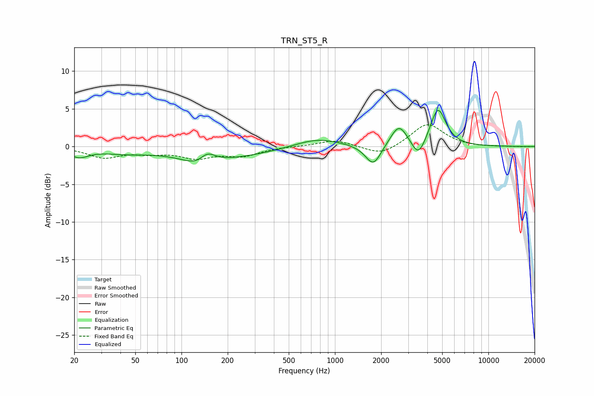

# TRN_ST5_R
See [usage instructions](https://github.com/jaakkopasanen/AutoEq#usage) for more options and info.

### Parametric EQs
Apply preamp of -4.9 dB when using parametric equalizer.

|   # | Type    |   Fc (Hz) |    Q |   Gain (dB) |
|-----|---------|-----------|------|-------------|
|   1 | Peaking |        21 | 2.26 |        -1.2 |
|   2 | Peaking |        42 | 0.89 |        -0.6 |
|   3 | Peaking |       129 | 1.65 |        -1.3 |
|   4 | Peaking |       147 | 2.75 |         1.5 |
|   5 | Peaking |       181 | 0.47 |        -1.5 |
|   6 | Peaking |       767 | 0.96 |         1.2 |
|   7 | Peaking |      1779 | 2.76 |        -2.8 |
|   8 | Peaking |      2613 | 2.56 |         2.9 |
|   9 | Peaking |      3500 | 3.2  |        -2.4 |
|  10 | Peaking |      4694 | 2.79 |         5.1 |

### Fixed Band EQs
When using fixed band (also called graphic) equalizer, apply preamp of **-3.0 dB** (if available) and set gains manually with these parameters.

|   # | Type    |   Fc (Hz) |    Q |   Gain (dB) |
|-----|---------|-----------|------|-------------|
|   1 | Peaking |        31 | 1.41 |        -1.4 |
|   2 | Peaking |        62 | 1.41 |        -0.7 |
|   3 | Peaking |       125 | 1.41 |        -1.4 |
|   4 | Peaking |       250 | 1.41 |        -1.1 |
|   5 | Peaking |       500 | 1.41 |         0   |
|   6 | Peaking |      1000 | 1.41 |         0.9 |
|   7 | Peaking |      2000 | 1.41 |        -1.3 |
|   8 | Peaking |      4000 | 1.41 |         3.1 |
|   9 | Peaking |      8000 | 1.41 |        -0.1 |
|  10 | Peaking |     16000 | 1.41 |        -0   |

### Graphs

