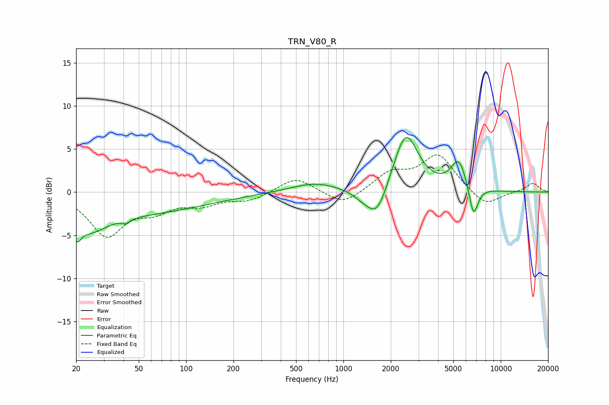

# TRN_V80_R
See [usage instructions](https://github.com/jaakkopasanen/AutoEq#usage) for more options and info.

### Parametric EQs
Apply preamp of -6.4 dB when using parametric equalizer.

|   # | Type    |   Fc (Hz) |    Q |   Gain (dB) |
|-----|---------|-----------|------|-------------|
|   1 | Peaking |        20 | 5.39 |        -2   |
|   2 | Peaking |        25 | 1.33 |        -2.3 |
|   3 | Peaking |        41 | 5.75 |        -0.5 |
|   4 | Peaking |        43 | 0.29 |        -2.4 |
|   5 | Peaking |       656 | 0.94 |         1.1 |
|   6 | Peaking |      1348 | 2.14 |        -0.9 |
|   7 | Peaking |      1645 | 2.27 |        -3.4 |
|   8 | Peaking |      2496 | 1.82 |         6.9 |
|   9 | Peaking |      5419 | 2.73 |         3.5 |
|  10 | Peaking |      6707 | 4.66 |        -3.8 |

### Fixed Band EQs
When using fixed band (also called graphic) equalizer, apply preamp of **-4.4 dB** (if available) and set gains manually with these parameters.

|   # | Type    |   Fc (Hz) |    Q |   Gain (dB) |
|-----|---------|-----------|------|-------------|
|   1 | Peaking |        31 | 1.41 |        -4.9 |
|   2 | Peaking |        62 | 1.41 |        -1.7 |
|   3 | Peaking |       125 | 1.41 |        -1.2 |
|   4 | Peaking |       250 | 1.41 |        -0.9 |
|   5 | Peaking |       500 | 1.41 |         1.8 |
|   6 | Peaking |      1000 | 1.41 |        -1.6 |
|   7 | Peaking |      2000 | 1.41 |         2.1 |
|   8 | Peaking |      4000 | 1.41 |         4.2 |
|   9 | Peaking |      8000 | 1.41 |        -1.8 |
|  10 | Peaking |     16000 | 1.41 |         1   |

### Graphs

