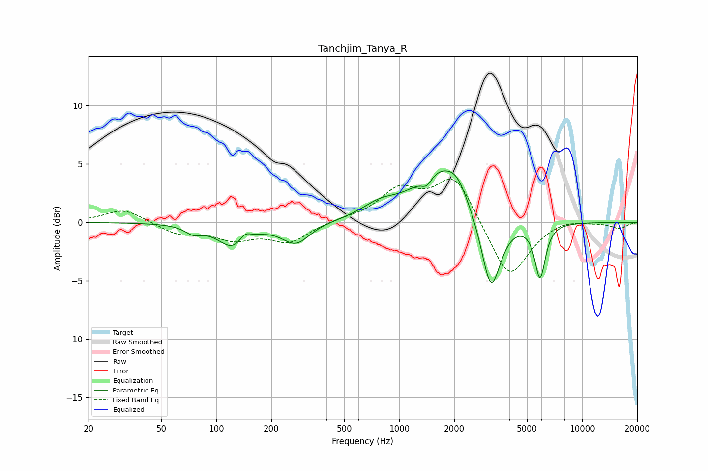

# Tanchjim_Tanya_R
See [usage instructions](https://github.com/jaakkopasanen/AutoEq#usage) for more options and info.

### Parametric EQs
Apply preamp of -4.5 dB when using parametric equalizer.

|   # | Type    |   Fc (Hz) |    Q |   Gain (dB) |
|-----|---------|-----------|------|-------------|
|   1 | Peaking |        75 | 3.2  |        -0.6 |
|   2 | Peaking |       124 | 1.74 |        -2.1 |
|   3 | Peaking |       143 | 4.3  |         0.8 |
|   4 | Peaking |       272 | 1.87 |        -1.8 |
|   5 | Peaking |       783 | 1.46 |         1.1 |
|   6 | Peaking |      1413 | 4.97 |        -0.9 |
|   7 | Peaking |      1702 | 0.99 |         4.5 |
|   8 | Peaking |      2070 | 2.79 |         1   |
|   9 | Peaking |      3171 | 2.63 |        -6.8 |
|  10 | Peaking |      5886 | 4.76 |        -4.7 |

### Fixed Band EQs
When using fixed band (also called graphic) equalizer, apply preamp of **-3.8 dB** (if available) and set gains manually with these parameters.

|   # | Type    |   Fc (Hz) |    Q |   Gain (dB) |
|-----|---------|-----------|------|-------------|
|   1 | Peaking |        31 | 1.41 |         1.2 |
|   2 | Peaking |        62 | 1.41 |        -1   |
|   3 | Peaking |       125 | 1.41 |        -1.3 |
|   4 | Peaking |       250 | 1.41 |        -1.6 |
|   5 | Peaking |       500 | 1.41 |         0.2 |
|   6 | Peaking |      1000 | 1.41 |         2.6 |
|   7 | Peaking |      2000 | 1.41 |         4   |
|   8 | Peaking |      4000 | 1.41 |        -5   |
|   9 | Peaking |      8000 | 1.41 |         0.4 |
|  10 | Peaking |     16000 | 1.41 |        -0.5 |

### Graphs

