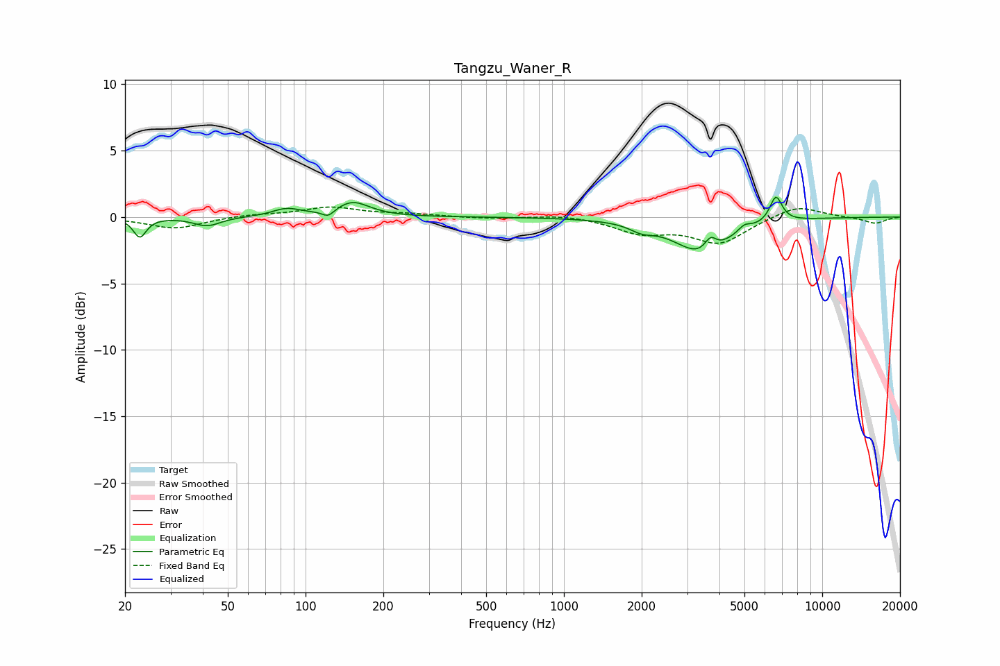

# Tangzu_Waner_R
See [usage instructions](https://github.com/jaakkopasanen/AutoEq#usage) for more options and info.

### Parametric EQs
Apply preamp of -1.6 dB when using parametric equalizer.

|   # | Type    |   Fc (Hz) |    Q |   Gain (dB) |
|-----|---------|-----------|------|-------------|
|   1 | Peaking |        23 | 5.79 |        -1.5 |
|   2 | Peaking |        42 | 2.74 |        -0.7 |
|   3 | Peaking |        84 | 2.61 |         0.6 |
|   4 | Peaking |       122 | 6    |        -0.5 |
|   5 | Peaking |       152 | 2.16 |         1.1 |
|   6 | Peaking |      2002 | 3.08 |        -0.5 |
|   7 | Peaking |      3438 | 1.33 |        -2.7 |
|   8 | Peaking |      3692 | 6    |         1   |
|   9 | Peaking |      4996 | 5.64 |         0.5 |
|  10 | Peaking |      6621 | 5.67 |         2   |

### Fixed Band EQs
When using fixed band (also called graphic) equalizer, apply preamp of **-0.9 dB** (if available) and set gains manually with these parameters.

|   # | Type    |   Fc (Hz) |    Q |   Gain (dB) |
|-----|---------|-----------|------|-------------|
|   1 | Peaking |        31 | 1.41 |        -0.9 |
|   2 | Peaking |        62 | 1.41 |         0.2 |
|   3 | Peaking |       125 | 1.41 |         0.7 |
|   4 | Peaking |       250 | 1.41 |         0.2 |
|   5 | Peaking |       500 | 1.41 |        -0.1 |
|   6 | Peaking |      1000 | 1.41 |         0.2 |
|   7 | Peaking |      2000 | 1.41 |        -1.1 |
|   8 | Peaking |      4000 | 1.41 |        -1.9 |
|   9 | Peaking |      8000 | 1.41 |         0.9 |
|  10 | Peaking |     16000 | 1.41 |        -0.5 |

### Graphs

