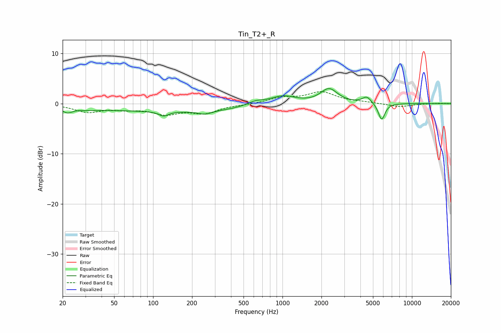

# Tin_T2+_R
See [usage instructions](https://github.com/jaakkopasanen/AutoEq#usage) for more options and info.

### Parametric EQs
Apply preamp of -3.1 dB when using parametric equalizer.

|   # | Type    |   Fc (Hz) |    Q |   Gain (dB) |
|-----|---------|-----------|------|-------------|
|   1 | Peaking |        22 | 3.57 |        -1.1 |
|   2 | Peaking |        31 | 1.58 |        -0.3 |
|   3 | Peaking |       121 | 3.93 |        -0.9 |
|   4 | Peaking |       146 | 0.18 |        -1.5 |
|   5 | Peaking |       252 | 2.55 |        -0.7 |
|   6 | Peaking |       619 | 2.03 |         0.9 |
|   7 | Peaking |      1003 | 1.4  |         1.8 |
|   8 | Peaking |      2288 | 2.16 |         2.9 |
|   9 | Peaking |      4479 | 4.15 |         1.3 |
|  10 | Peaking |      5836 | 5.38 |        -3.4 |

### Fixed Band EQs
When using fixed band (also called graphic) equalizer, apply preamp of **-2.5 dB** (if available) and set gains manually with these parameters.

|   # | Type    |   Fc (Hz) |    Q |   Gain (dB) |
|-----|---------|-----------|------|-------------|
|   1 | Peaking |        31 | 1.41 |        -1.6 |
|   2 | Peaking |        62 | 1.41 |        -0.8 |
|   3 | Peaking |       125 | 1.41 |        -1.8 |
|   4 | Peaking |       250 | 1.41 |        -1.7 |
|   5 | Peaking |       500 | 1.41 |        -0.2 |
|   6 | Peaking |      1000 | 1.41 |         1.1 |
|   7 | Peaking |      2000 | 1.41 |         2.2 |
|   8 | Peaking |      4000 | 1.41 |         0.2 |
|   9 | Peaking |      8000 | 1.41 |        -0.7 |
|  10 | Peaking |     16000 | 1.41 |         0.1 |

### Graphs

