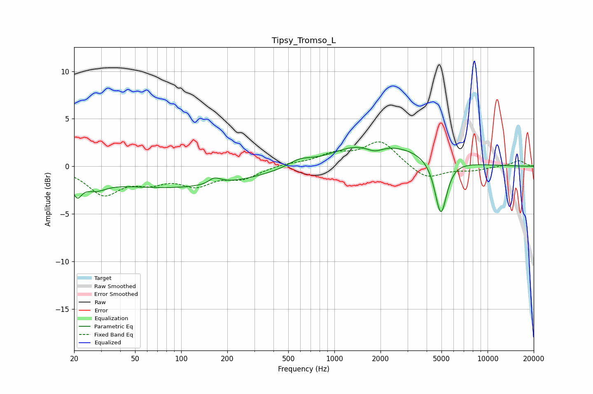

# Tipsy_Tromso_L
See [usage instructions](https://github.com/jaakkopasanen/AutoEq#usage) for more options and info.

### Parametric EQs
Apply preamp of -2.1 dB when using parametric equalizer.

|   # | Type    |   Fc (Hz) |    Q |   Gain (dB) |
|-----|---------|-----------|------|-------------|
|   1 | Peaking |        21 | 4.67 |        -1.8 |
|   2 | Peaking |        27 | 1.95 |        -1.1 |
|   3 | Peaking |        91 | 0.27 |        -2.2 |
|   4 | Peaking |       148 | 3.78 |        -0.2 |
|   5 | Peaking |       163 | 3.16 |         0.8 |
|   6 | Peaking |       592 | 1.93 |         0.7 |
|   7 | Peaking |      1317 | 0.92 |         0.8 |
|   8 | Peaking |      1831 | 2.54 |        -0.7 |
|   9 | Peaking |      2313 | 0.5  |         2   |
|  10 | Peaking |      4954 | 3.56 |        -6   |

### Fixed Band EQs
When using fixed band (also called graphic) equalizer, apply preamp of **-2.7 dB** (if available) and set gains manually with these parameters.

|   # | Type    |   Fc (Hz) |    Q |   Gain (dB) |
|-----|---------|-----------|------|-------------|
|   1 | Peaking |        31 | 1.41 |        -2.8 |
|   2 | Peaking |        62 | 1.41 |        -1.3 |
|   3 | Peaking |       125 | 1.41 |        -1.7 |
|   4 | Peaking |       250 | 1.41 |        -1.2 |
|   5 | Peaking |       500 | 1.41 |         0.3 |
|   6 | Peaking |      1000 | 1.41 |         1.1 |
|   7 | Peaking |      2000 | 1.41 |         2.6 |
|   8 | Peaking |      4000 | 1.41 |        -1.4 |
|   9 | Peaking |      8000 | 1.41 |        -0.4 |
|  10 | Peaking |     16000 | 1.41 |         0.6 |

### Graphs

