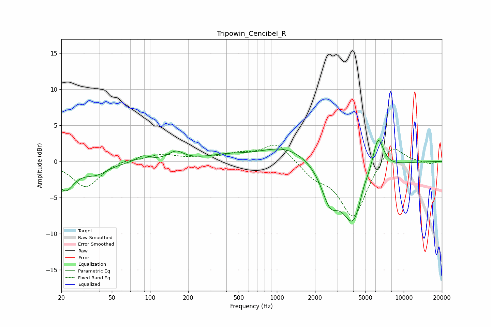

# Tripowin_Cencibel_R
See [usage instructions](https://github.com/jaakkopasanen/AutoEq#usage) for more options and info.

### Parametric EQs
Apply preamp of -3.0 dB when using parametric equalizer.

|   # | Type    |   Fc (Hz) |    Q |   Gain (dB) |
|-----|---------|-----------|------|-------------|
|   1 | Peaking |        21 | 2.04 |        -3.7 |
|   2 | Peaking |        38 | 1.46 |        -1.4 |
|   3 | Peaking |        88 | 2.82 |         0.8 |
|   4 | Peaking |       160 | 2.38 |         1.2 |
|   5 | Peaking |       401 | 0.94 |         0.6 |
|   6 | Peaking |      1180 | 0.72 |         2.1 |
|   7 | Peaking |      2619 | 2.12 |        -4.6 |
|   8 | Peaking |      4011 | 1.57 |        -8.4 |
|   9 | Peaking |      4811 | 3.52 |         1.3 |
|  10 | Peaking |      6266 | 3.09 |         5.2 |

### Fixed Band EQs
When using fixed band (also called graphic) equalizer, apply preamp of **-2.4 dB** (if available) and set gains manually with these parameters.

|   # | Type    |   Fc (Hz) |    Q |   Gain (dB) |
|-----|---------|-----------|------|-------------|
|   1 | Peaking |        31 | 1.41 |        -3.6 |
|   2 | Peaking |        62 | 1.41 |         0.4 |
|   3 | Peaking |       125 | 1.41 |         0.9 |
|   4 | Peaking |       250 | 1.41 |         0.4 |
|   5 | Peaking |       500 | 1.41 |         0.9 |
|   6 | Peaking |      1000 | 1.41 |         2.6 |
|   7 | Peaking |      2000 | 1.41 |        -1.8 |
|   8 | Peaking |      4000 | 1.41 |        -7.7 |
|   9 | Peaking |      8000 | 1.41 |         2.9 |
|  10 | Peaking |     16000 | 1.41 |        -0.4 |

### Graphs

