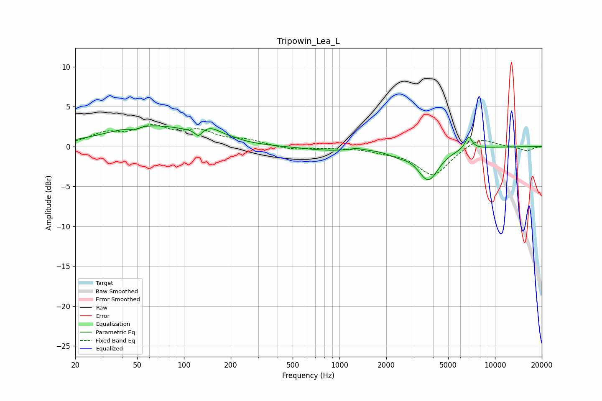

# Tripowin_Lea_L
See [usage instructions](https://github.com/jaakkopasanen/AutoEq#usage) for more options and info.

### Parametric EQs
Apply preamp of -2.7 dB when using parametric equalizer.

|   # | Type    |   Fc (Hz) |    Q |   Gain (dB) |
|-----|---------|-----------|------|-------------|
|   1 | Peaking |        48 | 4.97 |        -0.4 |
|   2 | Peaking |        60 | 0.52 |         2.6 |
|   3 | Peaking |       124 | 6    |        -0.9 |
|   4 | Peaking |       148 | 1.94 |         1.2 |
|   5 | Peaking |       206 | 2.81 |         0.2 |
|   6 | Peaking |       851 | 0.81 |        -0.5 |
|   7 | Peaking |      1282 | 3.78 |         0.2 |
|   8 | Peaking |      2369 | 2.1  |        -0.6 |
|   9 | Peaking |      3729 | 2.09 |        -4   |
|  10 | Peaking |      6768 | 5.94 |         1.6 |

### Fixed Band EQs
When using fixed band (also called graphic) equalizer, apply preamp of **-2.9 dB** (if available) and set gains manually with these parameters.

|   # | Type    |   Fc (Hz) |    Q |   Gain (dB) |
|-----|---------|-----------|------|-------------|
|   1 | Peaking |        31 | 1.41 |         1.5 |
|   2 | Peaking |        62 | 1.41 |         2.2 |
|   3 | Peaking |       125 | 1.41 |         1.7 |
|   4 | Peaking |       250 | 1.41 |         0.7 |
|   5 | Peaking |       500 | 1.41 |        -0.4 |
|   6 | Peaking |      1000 | 1.41 |        -0.1 |
|   7 | Peaking |      2000 | 1.41 |        -0.5 |
|   8 | Peaking |      4000 | 1.41 |        -3.6 |
|   9 | Peaking |      8000 | 1.41 |         1.3 |
|  10 | Peaking |     16000 | 1.41 |        -0.5 |

### Graphs

