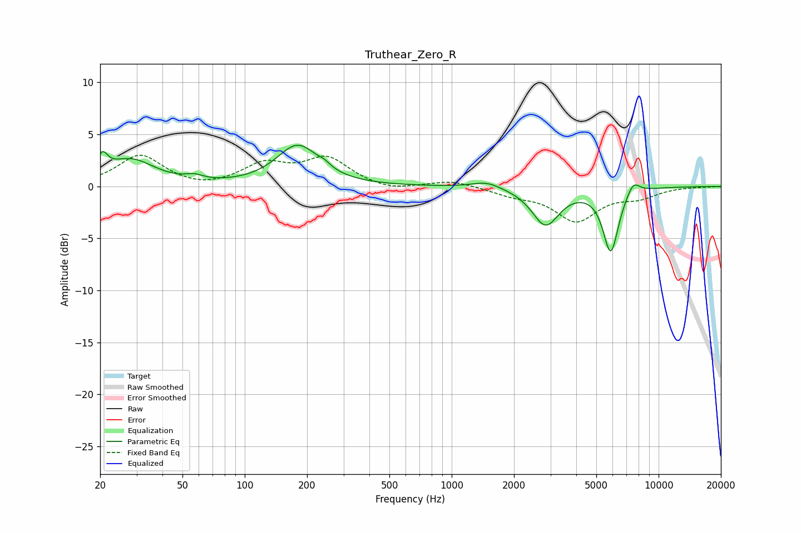

# Truthear_Zero_R
See [usage instructions](https://github.com/jaakkopasanen/AutoEq#usage) for more options and info.

### Parametric EQs
Apply preamp of -4.1 dB when using parametric equalizer.

|   # | Type    |   Fc (Hz) |    Q |   Gain (dB) |
|-----|---------|-----------|------|-------------|
|   1 | Peaking |        21 | 5.8  |         2.8 |
|   2 | Peaking |        21 | 5.96 |        -1.1 |
|   3 | Peaking |        28 | 1.21 |         2.5 |
|   4 | Peaking |        57 | 3.51 |         0.4 |
|   5 | Peaking |       180 | 1.4  |         3.9 |
|   6 | Peaking |       243 | 5.34 |         0.3 |
|   7 | Peaking |      1476 | 2.08 |         0.6 |
|   8 | Peaking |      2843 | 2.17 |        -3.6 |
|   9 | Peaking |      5870 | 3.68 |        -6.1 |
|  10 | Peaking |      7542 | 4.29 |         1.3 |

### Fixed Band EQs
When using fixed band (also called graphic) equalizer, apply preamp of **-3.1 dB** (if available) and set gains manually with these parameters.

|   # | Type    |   Fc (Hz) |    Q |   Gain (dB) |
|-----|---------|-----------|------|-------------|
|   1 | Peaking |        31 | 1.41 |         3   |
|   2 | Peaking |        62 | 1.41 |        -0.4 |
|   3 | Peaking |       125 | 1.41 |         2   |
|   4 | Peaking |       250 | 1.41 |         2.6 |
|   5 | Peaking |       500 | 1.41 |        -0.5 |
|   6 | Peaking |      1000 | 1.41 |         0.6 |
|   7 | Peaking |      2000 | 1.41 |        -0.7 |
|   8 | Peaking |      4000 | 1.41 |        -3.2 |
|   9 | Peaking |      8000 | 1.41 |        -0.9 |
|  10 | Peaking |     16000 | 1.41 |        -0   |

### Graphs

