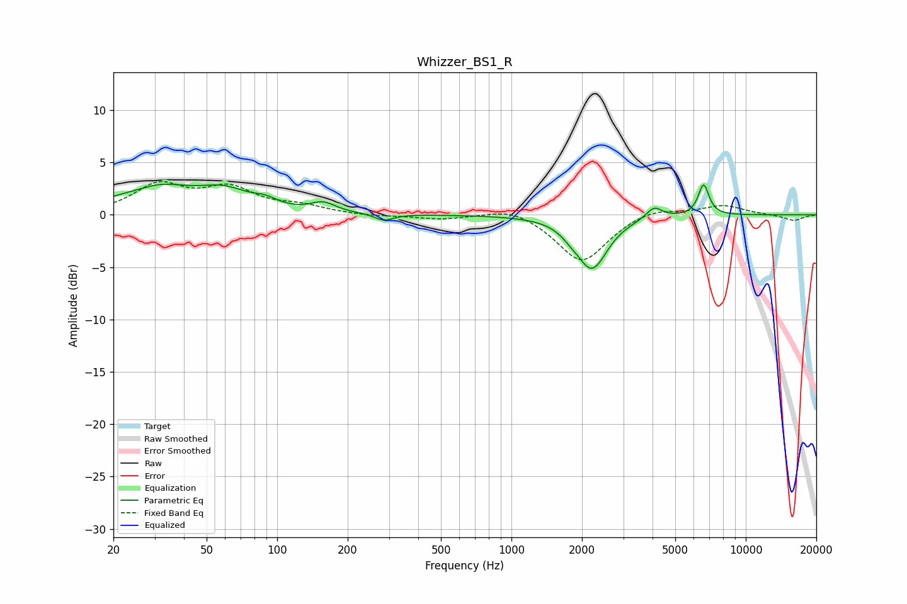

# Whizzer_BS1_R
See [usage instructions](https://github.com/jaakkopasanen/AutoEq#usage) for more options and info.

### Parametric EQs
Apply preamp of -3.0 dB when using parametric equalizer.

|   # | Type    |   Fc (Hz) |    Q |   Gain (dB) |
|-----|---------|-----------|------|-------------|
|   1 | Peaking |        26 | 1.61 |        -0.8 |
|   2 | Peaking |        29 | 0.96 |         3.1 |
|   3 | Peaking |        60 | 1.26 |         1.8 |
|   4 | Peaking |        89 | 2.86 |         0.6 |
|   5 | Peaking |       157 | 2.68 |         0.9 |
|   6 | Peaking |       286 | 3.59 |        -0.6 |
|   7 | Peaking |      1782 | 3.73 |        -0.4 |
|   8 | Peaking |      2206 | 2.16 |        -5   |
|   9 | Peaking |      4065 | 4.2  |         1.1 |
|  10 | Peaking |      6609 | 6    |         3   |

### Fixed Band EQs
When using fixed band (also called graphic) equalizer, apply preamp of **-3.3 dB** (if available) and set gains manually with these parameters.

|   # | Type    |   Fc (Hz) |    Q |   Gain (dB) |
|-----|---------|-----------|------|-------------|
|   1 | Peaking |        31 | 1.41 |         2.7 |
|   2 | Peaking |        62 | 1.41 |         2.3 |
|   3 | Peaking |       125 | 1.41 |         0.7 |
|   4 | Peaking |       250 | 1.41 |        -0.2 |
|   5 | Peaking |       500 | 1.41 |        -0.4 |
|   6 | Peaking |      1000 | 1.41 |         0.9 |
|   7 | Peaking |      2000 | 1.41 |        -4.6 |
|   8 | Peaking |      4000 | 1.41 |         0.8 |
|   9 | Peaking |      8000 | 1.41 |         0.9 |
|  10 | Peaking |     16000 | 1.41 |        -0.6 |

### Graphs

