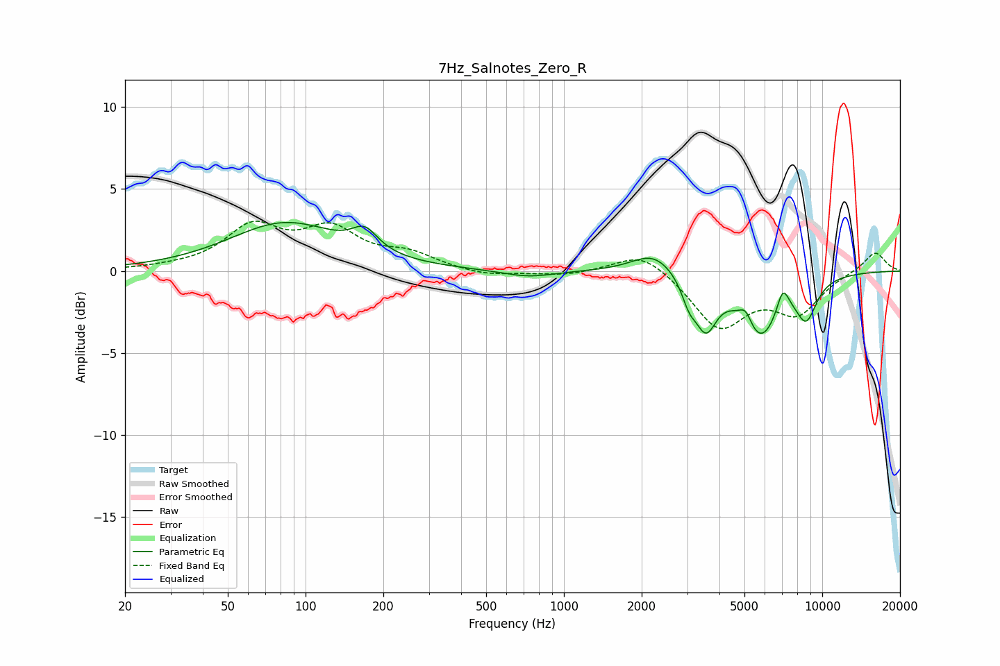

# 7Hz_Salnotes_Zero_R
See [usage instructions](https://github.com/jaakkopasanen/AutoEq#usage) for more options and info.

### Parametric EQs
Apply preamp of -3.1 dB when using parametric equalizer.

|   # | Type    |   Fc (Hz) |    Q |   Gain (dB) |
|-----|---------|-----------|------|-------------|
|   1 | Peaking |        84 | 0.66 |         2.9 |
|   2 | Peaking |       170 | 2.83 |         1.3 |
|   3 | Peaking |       728 | 1.39 |        -0.4 |
|   4 | Peaking |      2232 | 1.66 |         1.3 |
|   5 | Peaking |      3049 | 4.96 |        -1.2 |
|   6 | Peaking |      3543 | 3.33 |        -3   |
|   7 | Peaking |      5055 | 5.77 |         0.9 |
|   8 | Peaking |      5754 | 1.76 |        -3.9 |
|   9 | Peaking |      7041 | 5.72 |         1.6 |
|  10 | Peaking |      8677 | 3.21 |        -2.3 |

### Fixed Band EQs
When using fixed band (also called graphic) equalizer, apply preamp of **-3.1 dB** (if available) and set gains manually with these parameters.

|   # | Type    |   Fc (Hz) |    Q |   Gain (dB) |
|-----|---------|-----------|------|-------------|
|   1 | Peaking |        31 | 1.41 |         0.1 |
|   2 | Peaking |        62 | 1.41 |         2.5 |
|   3 | Peaking |       125 | 1.41 |         2.3 |
|   4 | Peaking |       250 | 1.41 |         0.9 |
|   5 | Peaking |       500 | 1.41 |        -0.3 |
|   6 | Peaking |      1000 | 1.41 |        -0.3 |
|   7 | Peaking |      2000 | 1.41 |         1.3 |
|   8 | Peaking |      4000 | 1.41 |        -3.4 |
|   9 | Peaking |      8000 | 1.41 |        -2.4 |
|  10 | Peaking |     16000 | 1.41 |         1.2 |

### Graphs

