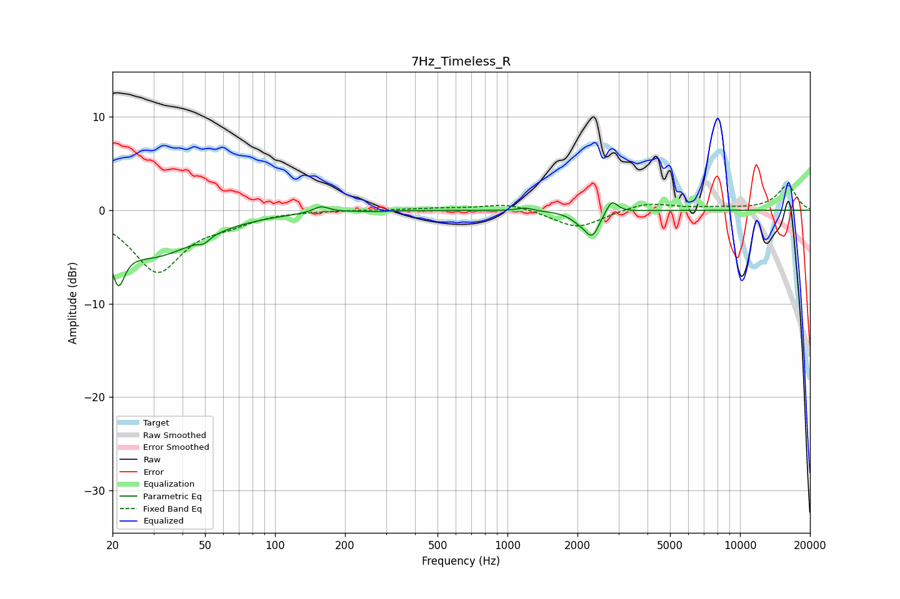

# 7Hz_Timeless_R
See [usage instructions](https://github.com/jaakkopasanen/AutoEq#usage) for more options and info.

### Parametric EQs
Apply preamp of -0.9 dB when using parametric equalizer.

|   # | Type    |   Fc (Hz) |    Q |   Gain (dB) |
|-----|---------|-----------|------|-------------|
|   1 | Peaking |        21 | 5.24 |        -4.2 |
|   2 | Peaking |        29 | 0.72 |        -4.8 |
|   3 | Peaking |        49 | 5.96 |        -0.6 |
|   4 | Peaking |       158 | 4.16 |         0.7 |
|   5 | Peaking |       273 | 6    |        -0.1 |
|   6 | Peaking |      1188 | 4.69 |         0.3 |
|   7 | Peaking |      2141 | 5.99 |         1.3 |
|   8 | Peaking |      2180 | 3.92 |        -3.2 |
|   9 | Peaking |      2360 | 5.99 |        -1   |
|  10 | Peaking |      2810 | 5.89 |         1.5 |

### Fixed Band EQs
When using fixed band (also called graphic) equalizer, apply preamp of **-2.7 dB** (if available) and set gains manually with these parameters.

|   # | Type    |   Fc (Hz) |    Q |   Gain (dB) |
|-----|---------|-----------|------|-------------|
|   1 | Peaking |        31 | 1.41 |        -6.5 |
|   2 | Peaking |        62 | 1.41 |        -1   |
|   3 | Peaking |       125 | 1.41 |         0   |
|   4 | Peaking |       250 | 1.41 |         0   |
|   5 | Peaking |       500 | 1.41 |         0.2 |
|   6 | Peaking |      1000 | 1.41 |         0.8 |
|   7 | Peaking |      2000 | 1.41 |        -2   |
|   8 | Peaking |      4000 | 1.41 |         0.9 |
|   9 | Peaking |      8000 | 1.41 |         0.2 |
|  10 | Peaking |     16000 | 1.41 |         2.6 |

### Graphs

