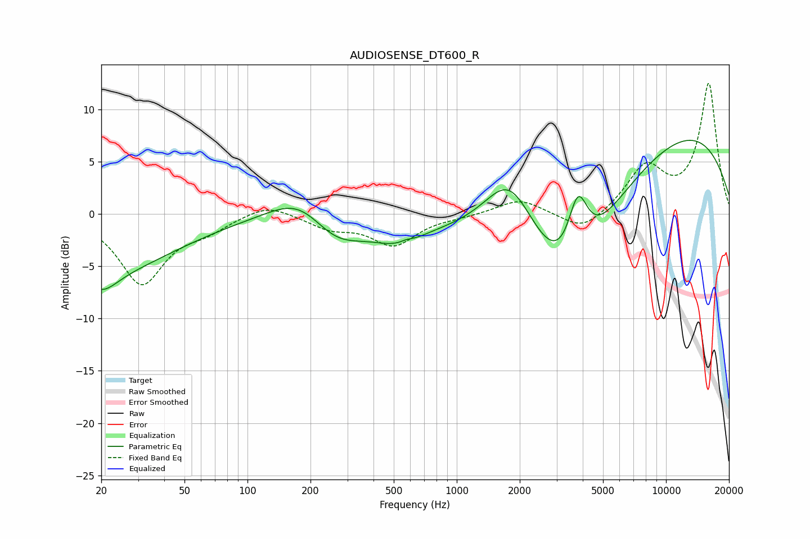

# AUDIOSENSE_DT600_R
See [usage instructions](https://github.com/jaakkopasanen/AutoEq#usage) for more options and info.

### Parametric EQs
Apply preamp of -7.1 dB when using parametric equalizer.

|   # | Type    |   Fc (Hz) |    Q |   Gain (dB) |
|-----|---------|-----------|------|-------------|
|   1 | Peaking |        20 | 1.87 |        -2.1 |
|   2 | Peaking |        21 | 0.43 |        -5.1 |
|   3 | Peaking |       179 | 1    |         2.8 |
|   4 | Peaking |       262 | 1.04 |        -2.9 |
|   5 | Peaking |       521 | 1.09 |        -1.9 |
|   6 | Peaking |       574 | 5.61 |         0.2 |
|   7 | Peaking |      1794 | 1.08 |         7.1 |
|   8 | Peaking |      3387 | 0.53 |       -14.8 |
|   9 | Peaking |      3792 | 2.85 |         6.4 |
|  10 | Peaking |      8603 | 0.24 |        10.3 |

### Fixed Band EQs
When using fixed band (also called graphic) equalizer, apply preamp of **-12.6 dB** (if available) and set gains manually with these parameters.

|   # | Type    |   Fc (Hz) |    Q |   Gain (dB) |
|-----|---------|-----------|------|-------------|
|   1 | Peaking |        31 | 1.41 |        -6.6 |
|   2 | Peaking |        62 | 1.41 |        -1.2 |
|   3 | Peaking |       125 | 1.41 |         1.1 |
|   4 | Peaking |       250 | 1.41 |        -1.2 |
|   5 | Peaking |       500 | 1.41 |        -2.9 |
|   6 | Peaking |      1000 | 1.41 |        -0.2 |
|   7 | Peaking |      2000 | 1.41 |         1.5 |
|   8 | Peaking |      4000 | 1.41 |        -1.9 |
|   9 | Peaking |      8000 | 1.41 |         4.3 |
|  10 | Peaking |     16000 | 1.41 |        12.4 |

### Graphs

