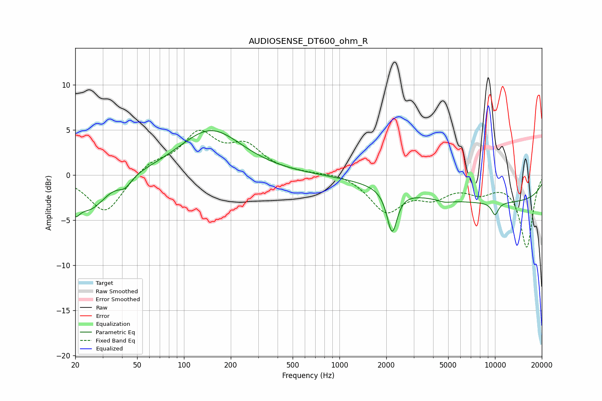

# AUDIOSENSE_DT600_ohm_R
See [usage instructions](https://github.com/jaakkopasanen/AutoEq#usage) for more options and info.

### Parametric EQs
Apply preamp of -5.0 dB when using parametric equalizer.

|   # | Type    |   Fc (Hz) |    Q |   Gain (dB) |
|-----|---------|-----------|------|-------------|
|   1 | Peaking |        20 | 5.35 |        -3.9 |
|   2 | Peaking |        20 | 6    |         1.8 |
|   3 | Peaking |        25 | 1.36 |        -3.7 |
|   4 | Peaking |        42 | 3.46 |        -1.1 |
|   5 | Peaking |       149 | 0.71 |         5   |
|   6 | Peaking |      2180 | 4.43 |        -4.7 |
|   7 | Peaking |      4762 | 3.14 |        -0.3 |
|   8 | Peaking |      9978 | 5.68 |         0   |
|   9 | Peaking |     10000 | 0.18 |        -3   |
|  10 | Peaking |     10000 | 5.46 |        -1.4 |

### Fixed Band EQs
When using fixed band (also called graphic) equalizer, apply preamp of **-5.0 dB** (if available) and set gains manually with these parameters.

|   # | Type    |   Fc (Hz) |    Q |   Gain (dB) |
|-----|---------|-----------|------|-------------|
|   1 | Peaking |        31 | 1.41 |        -4.3 |
|   2 | Peaking |        62 | 1.41 |         1.3 |
|   3 | Peaking |       125 | 1.41 |         4.3 |
|   4 | Peaking |       250 | 1.41 |         2.9 |
|   5 | Peaking |       500 | 1.41 |         0.1 |
|   6 | Peaking |      1000 | 1.41 |         0.3 |
|   7 | Peaking |      2000 | 1.41 |        -3.9 |
|   8 | Peaking |      4000 | 1.41 |        -2   |
|   9 | Peaking |      8000 | 1.41 |        -1.6 |
|  10 | Peaking |     16000 | 1.41 |        -8   |

### Graphs

