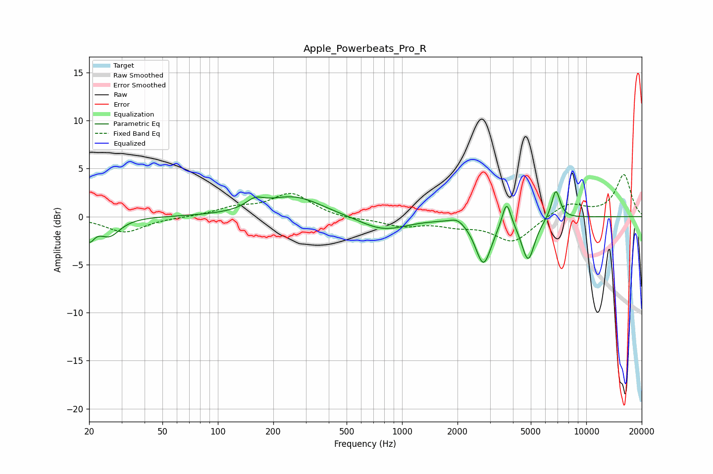

# Apple_Powerbeats_Pro_R
See [usage instructions](https://github.com/jaakkopasanen/AutoEq#usage) for more options and info.

### Parametric EQs
Apply preamp of -2.7 dB when using parametric equalizer.

|   # | Type    |   Fc (Hz) |    Q |   Gain (dB) |
|-----|---------|-----------|------|-------------|
|   1 | Peaking |        20 | 5.18 |        -2   |
|   2 | Peaking |        26 | 2.48 |        -1.9 |
|   3 | Peaking |       159 | 2.96 |         0.9 |
|   4 | Peaking |       259 | 0.91 |         2.1 |
|   5 | Peaking |       790 | 1.08 |        -1.5 |
|   6 | Peaking |      2001 | 3.71 |         0.6 |
|   7 | Peaking |      2767 | 3.27 |        -4.8 |
|   8 | Peaking |      3694 | 6    |         2.8 |
|   9 | Peaking |      4836 | 3.94 |        -4.4 |
|  10 | Peaking |      6832 | 5.84 |         3.1 |

### Fixed Band EQs
When using fixed band (also called graphic) equalizer, apply preamp of **-4.5 dB** (if available) and set gains manually with these parameters.

|   # | Type    |   Fc (Hz) |    Q |   Gain (dB) |
|-----|---------|-----------|------|-------------|
|   1 | Peaking |        31 | 1.41 |        -1.6 |
|   2 | Peaking |        62 | 1.41 |        -0.1 |
|   3 | Peaking |       125 | 1.41 |         0.8 |
|   4 | Peaking |       250 | 1.41 |         2.4 |
|   5 | Peaking |       500 | 1.41 |        -0.3 |
|   6 | Peaking |      1000 | 1.41 |        -0.9 |
|   7 | Peaking |      2000 | 1.41 |        -0.7 |
|   8 | Peaking |      4000 | 1.41 |        -2.6 |
|   9 | Peaking |      8000 | 1.41 |         1.4 |
|  10 | Peaking |     16000 | 1.41 |         4.3 |

### Graphs

