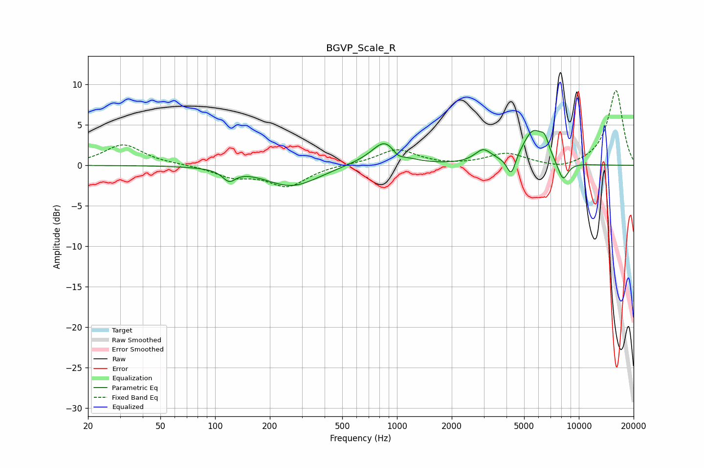

# BGVP_Scale_R
See [usage instructions](https://github.com/jaakkopasanen/AutoEq#usage) for more options and info.

### Parametric EQs
Apply preamp of -4.4 dB when using parametric equalizer.

|   # | Type    |   Fc (Hz) |    Q |   Gain (dB) |
|-----|---------|-----------|------|-------------|
|   1 | Peaking |       119 | 4.03 |        -1.3 |
|   2 | Peaking |       264 | 0.96 |        -2.6 |
|   3 | Peaking |       573 | 1.27 |         0.2 |
|   4 | Peaking |       866 | 1.9  |         3.2 |
|   5 | Peaking |      1008 | 4.09 |        -1   |
|   6 | Peaking |      2980 | 3.06 |         1.6 |
|   7 | Peaking |      4249 | 5.78 |        -2.5 |
|   8 | Peaking |      5618 | 2.28 |         4.2 |
|   9 | Peaking |      6492 | 5.98 |         1.5 |
|  10 | Peaking |      8171 | 4.44 |        -2.5 |

### Fixed Band EQs
When using fixed band (also called graphic) equalizer, apply preamp of **-9.3 dB** (if available) and set gains manually with these parameters.

|   # | Type    |   Fc (Hz) |    Q |   Gain (dB) |
|-----|---------|-----------|------|-------------|
|   1 | Peaking |        31 | 1.41 |         2.6 |
|   2 | Peaking |        62 | 1.41 |         0.1 |
|   3 | Peaking |       125 | 1.41 |        -1.3 |
|   4 | Peaking |       250 | 1.41 |        -2.5 |
|   5 | Peaking |       500 | 1.41 |         0.1 |
|   6 | Peaking |      1000 | 1.41 |         2   |
|   7 | Peaking |      2000 | 1.41 |        -0.1 |
|   8 | Peaking |      4000 | 1.41 |         1.4 |
|   9 | Peaking |      8000 | 1.41 |        -0.6 |
|  10 | Peaking |     16000 | 1.41 |         9.3 |

### Graphs

