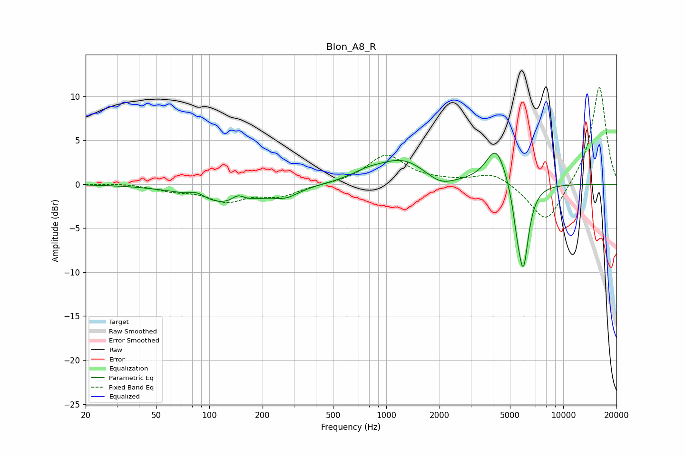

# Blon_A8_R
See [usage instructions](https://github.com/jaakkopasanen/AutoEq#usage) for more options and info.

### Parametric EQs
Apply preamp of -3.6 dB when using parametric equalizer.

|   # | Type    |   Fc (Hz) |    Q |   Gain (dB) |
|-----|---------|-----------|------|-------------|
|   1 | Peaking |        85 | 3.36 |         0.6 |
|   2 | Peaking |       125 | 0.78 |        -2.3 |
|   3 | Peaking |       145 | 4    |         0.8 |
|   4 | Peaking |       271 | 1.93 |        -1   |
|   5 | Peaking |       774 | 1.63 |         0.7 |
|   6 | Peaking |      1237 | 0.98 |         2.7 |
|   7 | Peaking |      2013 | 1.83 |        -1.2 |
|   8 | Peaking |      4180 | 2.42 |         4.3 |
|   9 | Peaking |      5467 | 5.99 |        -2.1 |
|  10 | Peaking |      5944 | 4.43 |        -9.5 |

### Fixed Band EQs
When using fixed band (also called graphic) equalizer, apply preamp of **-11.1 dB** (if available) and set gains manually with these parameters.

|   # | Type    |   Fc (Hz) |    Q |   Gain (dB) |
|-----|---------|-----------|------|-------------|
|   1 | Peaking |        31 | 1.41 |         0.1 |
|   2 | Peaking |        62 | 1.41 |        -0.6 |
|   3 | Peaking |       125 | 1.41 |        -1.8 |
|   4 | Peaking |       250 | 1.41 |        -1.2 |
|   5 | Peaking |       500 | 1.41 |        -0   |
|   6 | Peaking |      1000 | 1.41 |         3.3 |
|   7 | Peaking |      2000 | 1.41 |         0.2 |
|   8 | Peaking |      4000 | 1.41 |         1.4 |
|   9 | Peaking |      8000 | 1.41 |        -4.7 |
|  10 | Peaking |     16000 | 1.41 |        11.3 |

### Graphs

