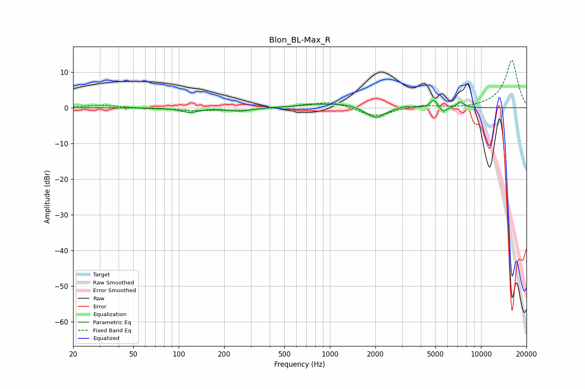

# Blon_BL-Max_R
See [usage instructions](https://github.com/jaakkopasanen/AutoEq#usage) for more options and info.

### Parametric EQs
Apply preamp of -2.1 dB when using parametric equalizer.

|   # | Type    |   Fc (Hz) |    Q |   Gain (dB) |
|-----|---------|-----------|------|-------------|
|   1 | Peaking |       118 | 2.52 |        -1.3 |
|   2 | Peaking |       253 | 1.83 |        -0.9 |
|   3 | Peaking |       726 | 1.94 |         0.6 |
|   4 | Peaking |      1242 | 1.03 |         1.2 |
|   5 | Peaking |      1784 | 2.01 |        -0.9 |
|   6 | Peaking |      2052 | 2.55 |        -2.6 |
|   7 | Peaking |      3127 | 4    |         0.5 |
|   8 | Peaking |      4881 | 6    |         2.4 |
|   9 | Peaking |      5607 | 6    |        -1.5 |
|  10 | Peaking |      7308 | 5.98 |         1.7 |

### Fixed Band EQs
When using fixed band (also called graphic) equalizer, apply preamp of **-13.4 dB** (if available) and set gains manually with these parameters.

|   # | Type    |   Fc (Hz) |    Q |   Gain (dB) |
|-----|---------|-----------|------|-------------|
|   1 | Peaking |        31 | 1.41 |         0.7 |
|   2 | Peaking |        62 | 1.41 |        -0.2 |
|   3 | Peaking |       125 | 1.41 |        -0.7 |
|   4 | Peaking |       250 | 1.41 |        -0.8 |
|   5 | Peaking |       500 | 1.41 |         0.2 |
|   6 | Peaking |      1000 | 1.41 |         1.8 |
|   7 | Peaking |      2000 | 1.41 |        -2.6 |
|   8 | Peaking |      4000 | 1.41 |         0.8 |
|   9 | Peaking |      8000 | 1.41 |        -0.3 |
|  10 | Peaking |     16000 | 1.41 |        13.4 |

### Graphs

