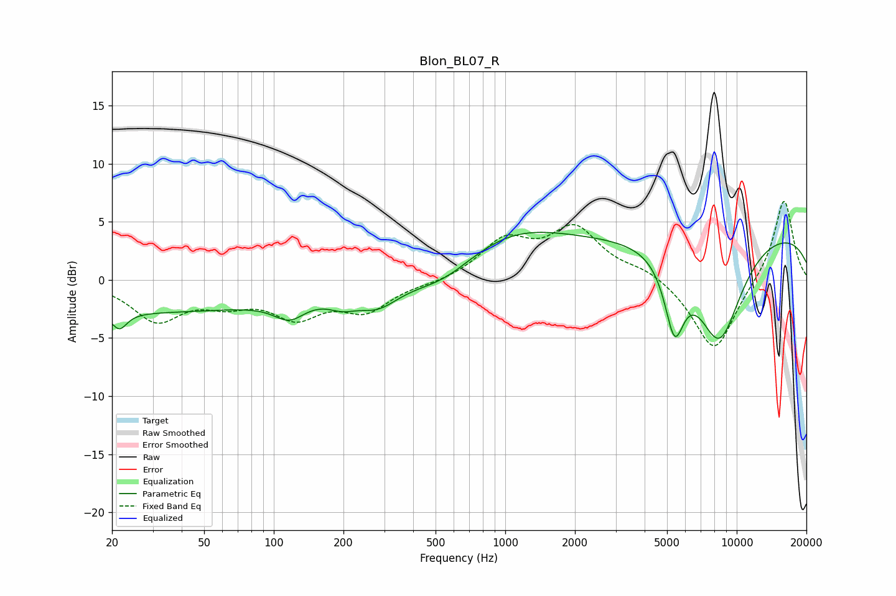

# Blon_BL07_R
See [usage instructions](https://github.com/jaakkopasanen/AutoEq#usage) for more options and info.

### Parametric EQs
Apply preamp of -4.2 dB when using parametric equalizer.

|   # | Type    |   Fc (Hz) |    Q |   Gain (dB) |
|-----|---------|-----------|------|-------------|
|   1 | Peaking |        22 | 4.43 |        -1.4 |
|   2 | Peaking |        24 | 0.18 |        -2.7 |
|   3 | Peaking |       117 | 2.09 |        -1.6 |
|   4 | Peaking |       197 | 2.33 |        -0.9 |
|   5 | Peaking |       281 | 1.49 |        -2   |
|   6 | Peaking |       542 | 0.97 |        -1.9 |
|   7 | Peaking |      1035 | 0.53 |         3.7 |
|   8 | Peaking |      5382 | 3.26 |        -6.1 |
|   9 | Peaking |      8398 | 1.26 |        -9.2 |
|  10 | Peaking |     10000 | 0.18 |         4.5 |

### Fixed Band EQs
When using fixed band (also called graphic) equalizer, apply preamp of **-6.9 dB** (if available) and set gains manually with these parameters.

|   # | Type    |   Fc (Hz) |    Q |   Gain (dB) |
|-----|---------|-----------|------|-------------|
|   1 | Peaking |        31 | 1.41 |        -3.3 |
|   2 | Peaking |        62 | 1.41 |        -1.5 |
|   3 | Peaking |       125 | 1.41 |        -2.8 |
|   4 | Peaking |       250 | 1.41 |        -2.4 |
|   5 | Peaking |       500 | 1.41 |        -0.3 |
|   6 | Peaking |      1000 | 1.41 |         3.2 |
|   7 | Peaking |      2000 | 1.41 |         4.2 |
|   8 | Peaking |      4000 | 1.41 |         0.8 |
|   9 | Peaking |      8000 | 1.41 |        -6.3 |
|  10 | Peaking |     16000 | 1.41 |         7.1 |

### Graphs

