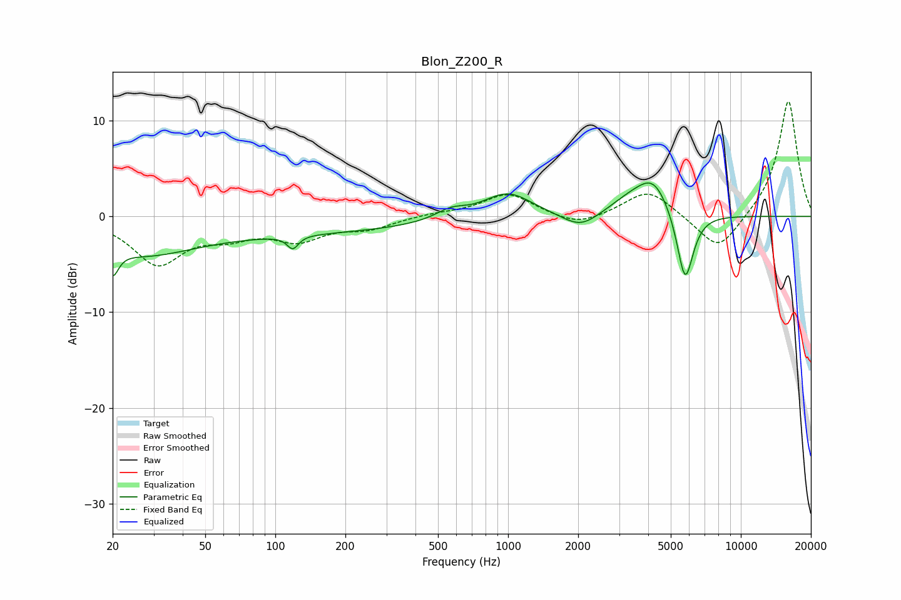

# Blon_Z200_R
See [usage instructions](https://github.com/jaakkopasanen/AutoEq#usage) for more options and info.

### Parametric EQs
Apply preamp of -3.6 dB when using parametric equalizer.

|   # | Type    |   Fc (Hz) |    Q |   Gain (dB) |
|-----|---------|-----------|------|-------------|
|   1 | Peaking |        20 | 5.77 |        -2.7 |
|   2 | Peaking |        26 | 0.66 |        -2.7 |
|   3 | Peaking |        91 | 0.19 |        -1.8 |
|   4 | Peaking |       119 | 5.97 |        -1.4 |
|   5 | Peaking |       567 | 2.17 |         1   |
|   6 | Peaking |       995 | 1.35 |         2.6 |
|   7 | Peaking |      2049 | 1.76 |        -1.7 |
|   8 | Peaking |      3380 | 1.42 |         1.5 |
|   9 | Peaking |      4234 | 1.96 |         3.4 |
|  10 | Peaking |      5762 | 3.88 |        -7.6 |

### Fixed Band EQs
When using fixed band (also called graphic) equalizer, apply preamp of **-12.1 dB** (if available) and set gains manually with these parameters.

|   # | Type    |   Fc (Hz) |    Q |   Gain (dB) |
|-----|---------|-----------|------|-------------|
|   1 | Peaking |        31 | 1.41 |        -4.8 |
|   2 | Peaking |        62 | 1.41 |        -1.6 |
|   3 | Peaking |       125 | 1.41 |        -2.2 |
|   4 | Peaking |       250 | 1.41 |        -1.1 |
|   5 | Peaking |       500 | 1.41 |         0.3 |
|   6 | Peaking |      1000 | 1.41 |         2.4 |
|   7 | Peaking |      2000 | 1.41 |        -1.2 |
|   8 | Peaking |      4000 | 1.41 |         2.9 |
|   9 | Peaking |      8000 | 1.41 |        -3.9 |
|  10 | Peaking |     16000 | 1.41 |        12.3 |

### Graphs

