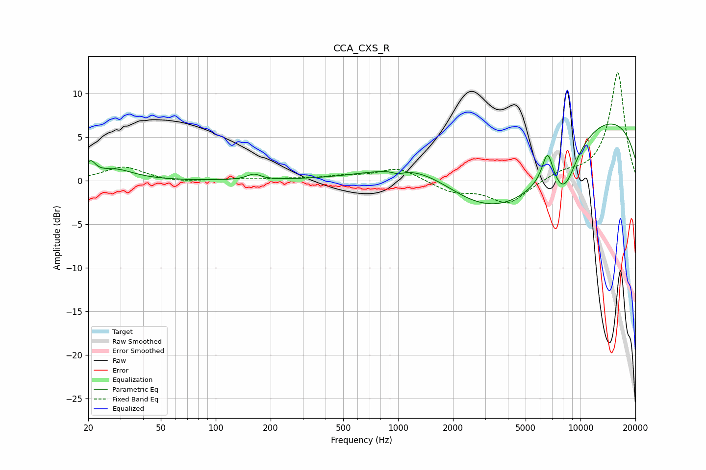

# CCA_CXS_R
See [usage instructions](https://github.com/jaakkopasanen/AutoEq#usage) for more options and info.

### Parametric EQs
Apply preamp of -6.6 dB when using parametric equalizer.

|   # | Type    |   Fc (Hz) |    Q |   Gain (dB) |
|-----|---------|-----------|------|-------------|
|   1 | Peaking |        21 | 5.21 |         1.6 |
|   2 | Peaking |        28 | 1.42 |         1.2 |
|   3 | Peaking |       162 | 3.86 |         0.6 |
|   4 | Peaking |       998 | 4.2  |        -0.4 |
|   5 | Peaking |      1337 | 0.59 |         2.3 |
|   6 | Peaking |      2586 | 0.58 |        -4.8 |
|   7 | Peaking |      4545 | 0.54 |        -6.6 |
|   8 | Peaking |      6600 | 4.57 |         3.7 |
|   9 | Peaking |      8139 | 1.84 |        -4.6 |
|  10 | Peaking |      9157 | 0.18 |         8.7 |

### Fixed Band EQs
When using fixed band (also called graphic) equalizer, apply preamp of **-12.5 dB** (if available) and set gains manually with these parameters.

|   # | Type    |   Fc (Hz) |    Q |   Gain (dB) |
|-----|---------|-----------|------|-------------|
|   1 | Peaking |        31 | 1.41 |         1.6 |
|   2 | Peaking |        62 | 1.41 |        -0.2 |
|   3 | Peaking |       125 | 1.41 |         0.2 |
|   4 | Peaking |       250 | 1.41 |         0.2 |
|   5 | Peaking |       500 | 1.41 |         0.4 |
|   6 | Peaking |      1000 | 1.41 |         1.5 |
|   7 | Peaking |      2000 | 1.41 |        -1.2 |
|   8 | Peaking |      4000 | 1.41 |        -2.6 |
|   9 | Peaking |      8000 | 1.41 |         0.8 |
|  10 | Peaking |     16000 | 1.41 |        12.5 |

### Graphs

