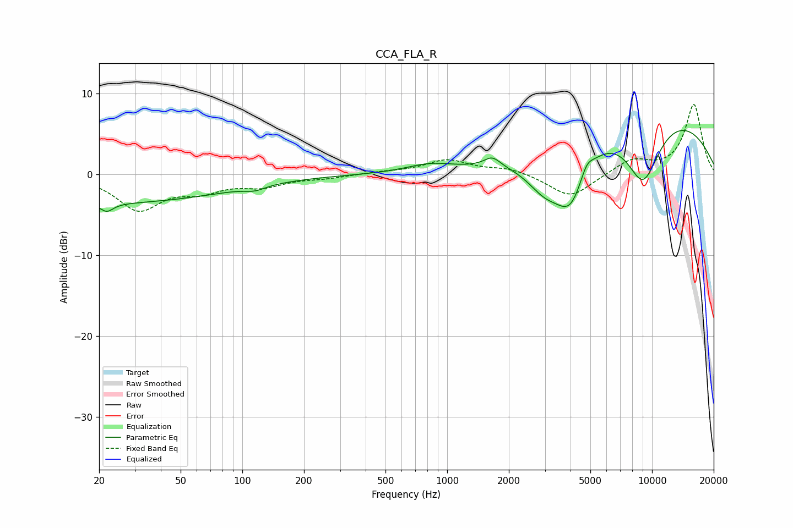

# CCA_FLA_R
See [usage instructions](https://github.com/jaakkopasanen/AutoEq#usage) for more options and info.

### Parametric EQs
Apply preamp of -5.6 dB when using parametric equalizer.

|   # | Type    |   Fc (Hz) |    Q |   Gain (dB) |
|-----|---------|-----------|------|-------------|
|   1 | Peaking |        20 | 0.21 |        -3.5 |
|   2 | Peaking |        22 | 4.55 |        -1   |
|   3 | Peaking |       115 | 2.77 |        -0.5 |
|   4 | Peaking |       824 | 1.21 |         1   |
|   5 | Peaking |      1660 | 3.51 |         1.3 |
|   6 | Peaking |      2992 | 1.53 |        -3.9 |
|   7 | Peaking |      4002 | 1.81 |        -6.7 |
|   8 | Peaking |      4795 | 4.57 |         1.5 |
|   9 | Peaking |      9038 | 1.47 |        -8.2 |
|  10 | Peaking |      9476 | 0.28 |         8.2 |

### Fixed Band EQs
When using fixed band (also called graphic) equalizer, apply preamp of **-8.8 dB** (if available) and set gains manually with these parameters.

|   # | Type    |   Fc (Hz) |    Q |   Gain (dB) |
|-----|---------|-----------|------|-------------|
|   1 | Peaking |        31 | 1.41 |        -4.2 |
|   2 | Peaking |        62 | 1.41 |        -1.7 |
|   3 | Peaking |       125 | 1.41 |        -1.3 |
|   4 | Peaking |       250 | 1.41 |        -0.4 |
|   5 | Peaking |       500 | 1.41 |         0.3 |
|   6 | Peaking |      1000 | 1.41 |         1.7 |
|   7 | Peaking |      2000 | 1.41 |         0.8 |
|   8 | Peaking |      4000 | 1.41 |        -2.9 |
|   9 | Peaking |      8000 | 1.41 |         1.8 |
|  10 | Peaking |     16000 | 1.41 |         8.7 |

### Graphs

