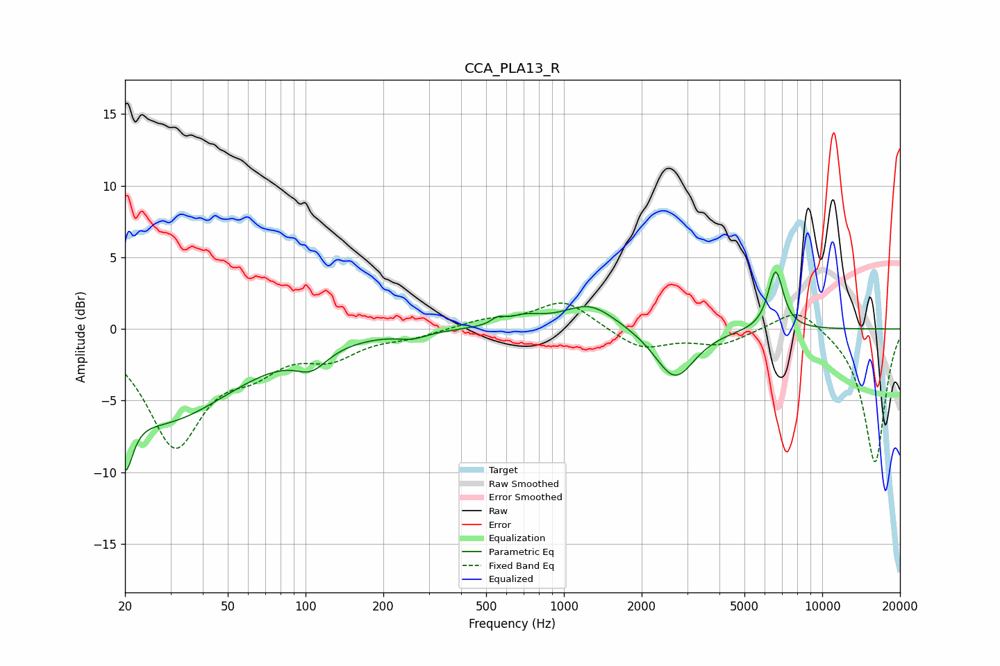

# CCA_PLA13_R
See [usage instructions](https://github.com/jaakkopasanen/AutoEq#usage) for more options and info.

### Parametric EQs
Apply preamp of -4.1 dB when using parametric equalizer.

|   # | Type    |   Fc (Hz) |    Q |   Gain (dB) |
|-----|---------|-----------|------|-------------|
|   1 | Peaking |        20 | 4.85 |        -4.2 |
|   2 | Peaking |        28 | 0.51 |        -6.3 |
|   3 | Peaking |       105 | 2.26 |        -1.4 |
|   4 | Peaking |       259 | 2.65 |        -0.4 |
|   5 | Peaking |       555 | 5.84 |         0.4 |
|   6 | Peaking |       706 | 2.02 |         0.7 |
|   7 | Peaking |      1261 | 1.39 |         1.8 |
|   8 | Peaking |      2675 | 1.92 |        -0.8 |
|   9 | Peaking |      2693 | 1.84 |        -2.8 |
|  10 | Peaking |      6601 | 4.61 |         4.2 |

### Fixed Band EQs
When using fixed band (also called graphic) equalizer, apply preamp of **-1.9 dB** (if available) and set gains manually with these parameters.

|   # | Type    |   Fc (Hz) |    Q |   Gain (dB) |
|-----|---------|-----------|------|-------------|
|   1 | Peaking |        31 | 1.41 |        -7.9 |
|   2 | Peaking |        62 | 1.41 |        -2   |
|   3 | Peaking |       125 | 1.41 |        -1.7 |
|   4 | Peaking |       250 | 1.41 |        -0.5 |
|   5 | Peaking |       500 | 1.41 |         0.6 |
|   6 | Peaking |      1000 | 1.41 |         2   |
|   7 | Peaking |      2000 | 1.41 |        -1.4 |
|   8 | Peaking |      4000 | 1.41 |        -1   |
|   9 | Peaking |      8000 | 1.41 |         1.7 |
|  10 | Peaking |     16000 | 1.41 |        -9.4 |

### Graphs

