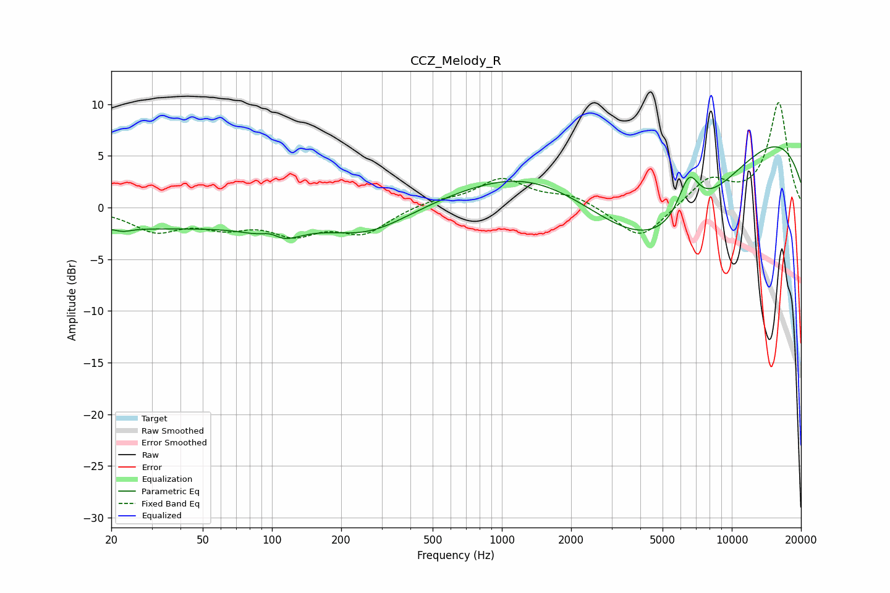

# CCZ_Melody_R
See [usage instructions](https://github.com/jaakkopasanen/AutoEq#usage) for more options and info.

### Parametric EQs
Apply preamp of -6.0 dB when using parametric equalizer.

|   # | Type    |   Fc (Hz) |    Q |   Gain (dB) |
|-----|---------|-----------|------|-------------|
|   1 | Peaking |        23 | 4.18 |        -0.3 |
|   2 | Peaking |        24 | 0.21 |        -2   |
|   3 | Peaking |        99 | 2.86 |         1.4 |
|   4 | Peaking |       104 | 1.68 |        -2.3 |
|   5 | Peaking |       262 | 0.79 |        -2.4 |
|   6 | Peaking |      1410 | 0.45 |         4.2 |
|   7 | Peaking |      4506 | 0.46 |        -4.6 |
|   8 | Peaking |      5146 | 0.36 |        -8.2 |
|   9 | Peaking |      6499 | 2.93 |         4.1 |
|  10 | Peaking |      9353 | 0.22 |        10.4 |

### Fixed Band EQs
When using fixed band (also called graphic) equalizer, apply preamp of **-10.2 dB** (if available) and set gains manually with these parameters.

|   # | Type    |   Fc (Hz) |    Q |   Gain (dB) |
|-----|---------|-----------|------|-------------|
|   1 | Peaking |        31 | 1.41 |        -2.1 |
|   2 | Peaking |        62 | 1.41 |        -1.5 |
|   3 | Peaking |       125 | 1.41 |        -2.2 |
|   4 | Peaking |       250 | 1.41 |        -2.3 |
|   5 | Peaking |       500 | 1.41 |         0.6 |
|   6 | Peaking |      1000 | 1.41 |         2.7 |
|   7 | Peaking |      2000 | 1.41 |         1.1 |
|   8 | Peaking |      4000 | 1.41 |        -3.3 |
|   9 | Peaking |      8000 | 1.41 |         2.7 |
|  10 | Peaking |     16000 | 1.41 |        10.1 |

### Graphs

