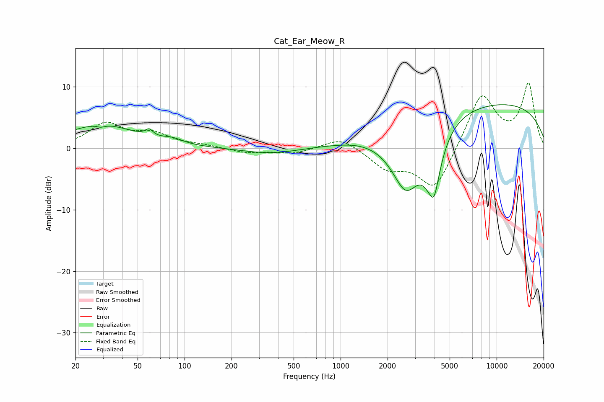

# Cat_Ear_Meow_R
See [usage instructions](https://github.com/jaakkopasanen/AutoEq#usage) for more options and info.

### Parametric EQs
Apply preamp of -7.2 dB when using parametric equalizer.

|   # | Type    |   Fc (Hz) |    Q |   Gain (dB) |
|-----|---------|-----------|------|-------------|
|   1 | Peaking |        29 | 5.33 |        -0.4 |
|   2 | Peaking |        29 | 0.64 |         3.8 |
|   3 | Peaking |        59 | 6    |         1.1 |
|   4 | Peaking |        83 | 2.17 |         0.7 |
|   5 | Peaking |       360 | 0.78 |        -1   |
|   6 | Peaking |      1260 | 2.17 |         0   |
|   7 | Peaking |      2628 | 1.36 |       -10.6 |
|   8 | Peaking |      3847 | 6    |         3.2 |
|   9 | Peaking |      3902 | 3.35 |       -13.1 |
|  10 | Peaking |      8378 | 0.19 |         7.7 |

### Fixed Band EQs
When using fixed band (also called graphic) equalizer, apply preamp of **-10.7 dB** (if available) and set gains manually with these parameters.

|   # | Type    |   Fc (Hz) |    Q |   Gain (dB) |
|-----|---------|-----------|------|-------------|
|   1 | Peaking |        31 | 1.41 |         3.8 |
|   2 | Peaking |        62 | 1.41 |         2.1 |
|   3 | Peaking |       125 | 1.41 |         0.4 |
|   4 | Peaking |       250 | 1.41 |        -0.7 |
|   5 | Peaking |       500 | 1.41 |        -0.9 |
|   6 | Peaking |      1000 | 1.41 |         1.9 |
|   7 | Peaking |      2000 | 1.41 |        -3.1 |
|   8 | Peaking |      4000 | 1.41 |        -7   |
|   9 | Peaking |      8000 | 1.41 |         9   |
|  10 | Peaking |     16000 | 1.41 |        10.3 |

### Graphs

