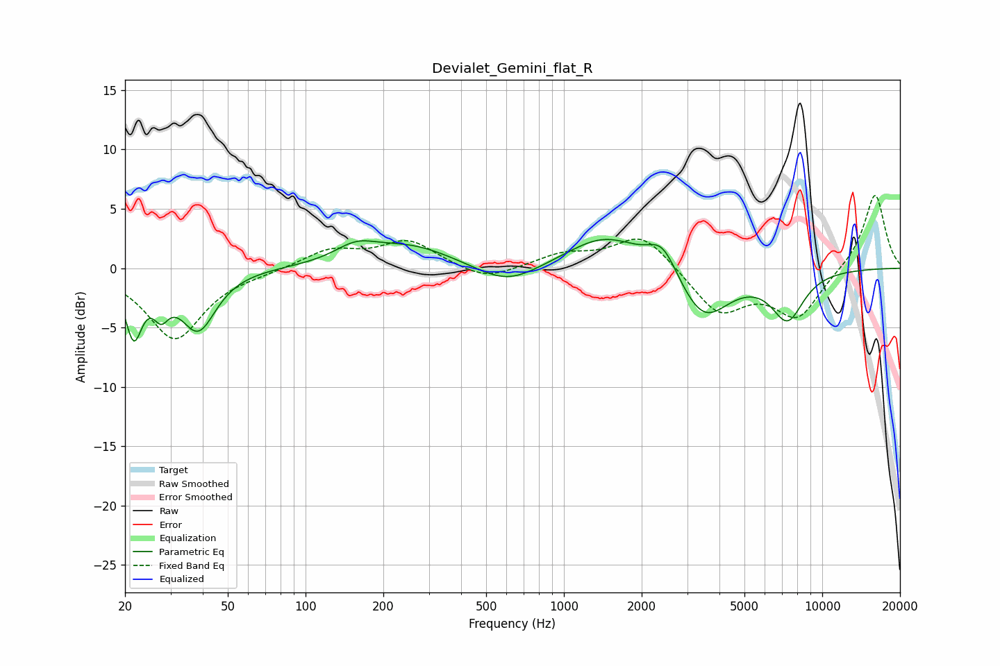

# Devialet_Gemini_flat_R
See [usage instructions](https://github.com/jaakkopasanen/AutoEq#usage) for more options and info.

### Parametric EQs
Apply preamp of -2.5 dB when using parametric equalizer.

|   # | Type    |   Fc (Hz) |    Q |   Gain (dB) |
|-----|---------|-----------|------|-------------|
|   1 | Peaking |        22 | 4.38 |        -5.1 |
|   2 | Peaking |        28 | 4.82 |        -2.1 |
|   3 | Peaking |        38 | 2.07 |        -5   |
|   4 | Peaking |       156 | 1.75 |         1.3 |
|   5 | Peaking |       254 | 0.83 |         1.9 |
|   6 | Peaking |       604 | 1.16 |        -1.8 |
|   7 | Peaking |      1444 | 0.97 |         2.8 |
|   8 | Peaking |      2411 | 2.43 |         2.5 |
|   9 | Peaking |      3463 | 1.4  |        -4.5 |
|  10 | Peaking |      7340 | 2.13 |        -4   |

### Fixed Band EQs
When using fixed band (also called graphic) equalizer, apply preamp of **-6.2 dB** (if available) and set gains manually with these parameters.

|   # | Type    |   Fc (Hz) |    Q |   Gain (dB) |
|-----|---------|-----------|------|-------------|
|   1 | Peaking |        31 | 1.41 |        -6   |
|   2 | Peaking |        62 | 1.41 |        -0.2 |
|   3 | Peaking |       125 | 1.41 |         1.5 |
|   4 | Peaking |       250 | 1.41 |         2.2 |
|   5 | Peaking |       500 | 1.41 |        -1.2 |
|   6 | Peaking |      1000 | 1.41 |         1.1 |
|   7 | Peaking |      2000 | 1.41 |         3   |
|   8 | Peaking |      4000 | 1.41 |        -3.7 |
|   9 | Peaking |      8000 | 1.41 |        -4   |
|  10 | Peaking |     16000 | 1.41 |         6.4 |

### Graphs

