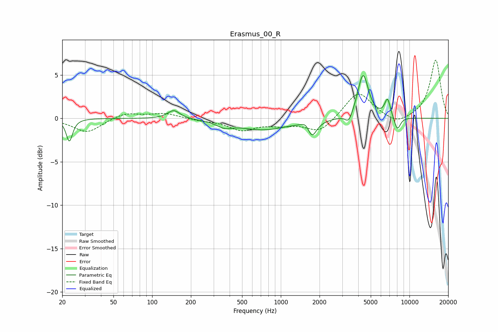

# Erasmus_00_R
See [usage instructions](https://github.com/jaakkopasanen/AutoEq#usage) for more options and info.

### Parametric EQs
Apply preamp of -5.0 dB when using parametric equalizer.

|   # | Type    |   Fc (Hz) |    Q |   Gain (dB) |
|-----|---------|-----------|------|-------------|
|   1 | Peaking |        23 | 5.86 |        -2.6 |
|   2 | Peaking |       147 | 2.96 |         1   |
|   3 | Peaking |       366 | 2.35 |        -0.6 |
|   4 | Peaking |       732 | 0.75 |        -1.3 |
|   5 | Peaking |      1589 | 4.28 |         0.9 |
|   6 | Peaking |      1732 | 3.78 |        -2.1 |
|   7 | Peaking |      3378 | 4.96 |        -1.1 |
|   8 | Peaking |      4360 | 3.41 |         5.1 |
|   9 | Peaking |      6753 | 5.97 |         2.1 |
|  10 | Peaking |      8053 | 5.39 |        -1.6 |

### Fixed Band EQs
When using fixed band (also called graphic) equalizer, apply preamp of **-6.8 dB** (if available) and set gains manually with these parameters.

|   # | Type    |   Fc (Hz) |    Q |   Gain (dB) |
|-----|---------|-----------|------|-------------|
|   1 | Peaking |        31 | 1.41 |        -1.6 |
|   2 | Peaking |        62 | 1.41 |         0.7 |
|   3 | Peaking |       125 | 1.41 |         0.6 |
|   4 | Peaking |       250 | 1.41 |        -0.2 |
|   5 | Peaking |       500 | 1.41 |        -1.3 |
|   6 | Peaking |      1000 | 1.41 |        -0.6 |
|   7 | Peaking |      2000 | 1.41 |        -1.6 |
|   8 | Peaking |      4000 | 1.41 |         3.1 |
|   9 | Peaking |      8000 | 1.41 |        -0.8 |
|  10 | Peaking |     16000 | 1.41 |         6.8 |

### Graphs

