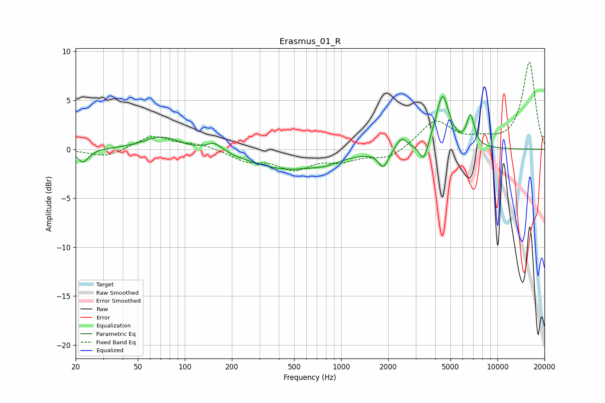

# Erasmus_01_R
See [usage instructions](https://github.com/jaakkopasanen/AutoEq#usage) for more options and info.

### Parametric EQs
Apply preamp of -5.5 dB when using parametric equalizer.

|   # | Type    |   Fc (Hz) |    Q |   Gain (dB) |
|-----|---------|-----------|------|-------------|
|   1 | Peaking |        22 | 3.92 |        -1.4 |
|   2 | Peaking |        71 | 1.25 |         1.4 |
|   3 | Peaking |       155 | 2.72 |         1   |
|   4 | Peaking |       460 | 0.57 |        -2   |
|   5 | Peaking |       797 | 2.08 |        -0.3 |
|   6 | Peaking |      1863 | 4.66 |        -1.7 |
|   7 | Peaking |      2438 | 4.03 |         1.3 |
|   8 | Peaking |      3374 | 5.28 |        -2   |
|   9 | Peaking |      4453 | 3.29 |         5.5 |
|  10 | Peaking |      6728 | 5.59 |         3.1 |

### Fixed Band EQs
When using fixed band (also called graphic) equalizer, apply preamp of **-9.0 dB** (if available) and set gains manually with these parameters.

|   # | Type    |   Fc (Hz) |    Q |   Gain (dB) |
|-----|---------|-----------|------|-------------|
|   1 | Peaking |        31 | 1.41 |        -0.8 |
|   2 | Peaking |        62 | 1.41 |         1.4 |
|   3 | Peaking |       125 | 1.41 |         0.5 |
|   4 | Peaking |       250 | 1.41 |        -1.1 |
|   5 | Peaking |       500 | 1.41 |        -1.8 |
|   6 | Peaking |      1000 | 1.41 |        -1   |
|   7 | Peaking |      2000 | 1.41 |        -1   |
|   8 | Peaking |      4000 | 1.41 |         2.9 |
|   9 | Peaking |      8000 | 1.41 |         0.7 |
|  10 | Peaking |     16000 | 1.41 |         8.9 |

### Graphs

